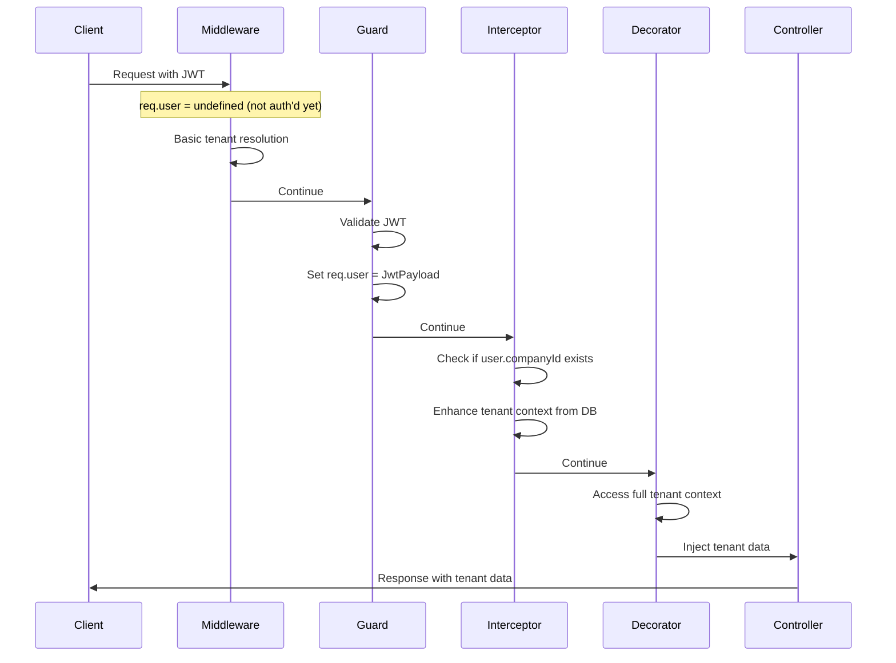

# Phase 1.4: Tenant Context Resolution - Complete Documentation

## 📋 Table of Contents
1. [Overview](#overview)
2. [Architecture & Flow](#architecture--flow)
3. [Problems Faced & Solutions](#problems-faced--solutions)
4. [Implementation Details](#implementation-details)
5. [Frontend Integration Guide](#frontend-integration-guide)
6. [Usage Examples](#usage-examples)
7. [Testing & Verification](#testing--verification)
8. [Troubleshooting](#troubleshooting)

---

## 📖 Overview

**Phase 1.4** implements **Multi-Tenant Context Resolution** - the ability to automatically detect which company/tenant a request belongs to and provide that context throughout the application.

### 🎯 Goals Achieved
- ✅ **Automatic tenant detection** from multiple sources
- ✅ **Seamless JWT-based resolution** for authenticated users
- ✅ **Subdomain-based routing** (abc.myerp.com → ABC Company)
- ✅ **Header-based fallback** for API clients
- ✅ **Type-safe decorators** for easy controller access
- ✅ **Performance optimization** with caching
- ✅ **Production-ready error handling**

### 🏗️ Core Components Built
- **TenantContextMiddleware** - Global request interception
- **TenantResolverService** - Database lookup with caching
- **TenantContextInterceptor** - Post-authentication enhancement
- **@Tenant() Decorator** - Type-safe controller access
- **Type Definitions** - Complete TypeScript support

---

## 🏛️ Architecture & Flow

### 🔄 Request Processing Flow

```mermaid
graph TD
    A[Incoming Request] --> B[TenantContextMiddleware]
    B --> C{Has Subdomain?}
    C -->|Yes| D[Resolve from Subdomain]
    C -->|No| E{Has X-Company-Id Header?}
    E -->|Yes| F[Resolve from Header]
    E -->|No| G[Set Unknown Context]
    
    D --> H[Store in req.tenantContext]
    F --> H
    G --> H
    
    H --> I[JwtGuard - Authentication]
    I --> J{User Authenticated?}
    J -->|Yes| K[TenantContextInterceptor]
    J -->|No| L[Continue to Controller]
    
    K --> M{Has Company ID in JWT?}
    M -->|Yes| N[Enhance with DB Lookup]
    M -->|No| O[Keep Current Context]
    
    N --> P[Update req.tenantContext]
    O --> P
    P --> Q[Controller Method]
    Q --> R[@Tenant() Decorator]
    R --> S[Return Tenant Data]
    
    L --> Q
```

### 🏗️ System Architecture

```mermaid
graph LR
    subgraph "Request Sources"
        A1[abc.myerp.com]
        A2[JWT Token]
        A3[X-Company-Id Header]
    end
    
    subgraph "Processing Layer"
        B1[TenantContextMiddleware]
        B2[JwtGuard]
        B3[TenantContextInterceptor]
    end
    
    subgraph "Services"
        C1[TenantResolverService]
        C2[PrismaService]
        C3[LRU Cache]
    end
    
    subgraph "Controller Layer"
        D1[@Tenant() Decorator]
        D2[Controller Methods]
    end
    
    A1 --> B1
    A2 --> B2
    A3 --> B1
    
    B1 --> C1
    B2 --> B3
    B3 --> C1
    
    C1 --> C2
    C1 --> C3
    
    B3 --> D1
    D1 --> D2
```

### 🔄 Execution Order (Critical Understanding)



---

## 🚫 Problems Faced & Solutions

### ❌ Problem 1: "Tenant context not found" Error

**Issue**: The original implementation threw errors when tenant context wasn't fully resolved.

**Root Cause**: Middleware ran before JWT authentication, so `req.user` was undefined during tenant resolution.

**Time Spent**: ~2 hours debugging

**Solution**: 
- Created `TenantContextInterceptor` that runs **after** authentication
- Enhanced tenant context with database lookup when JWT is available
- Never throw errors - always provide fallback data

```typescript
// ❌ Old problematic approach
if (!tenantContext.tenantInfo) {
  throw new BadRequestException('Tenant context not found');
}

// ✅ New solution
if (!tenantContext.tenantInfo && user?.companyId) {
  // Enhance context via interceptor
  const enhanced = await this.tenantResolver.resolveFromJWT(user.companyId);
  req.tenantContext = enhanced;
}
```

### ❌ Problem 2: Execution Order Confusion

**Issue**: Middleware → Guards → Interceptors → Controllers order wasn't clear.

**Root Cause**: Misunderstanding of NestJS execution pipeline.

**Time Spent**: ~3 hours testing different approaches

**Solution**: 
- Documented exact execution order
- Used middleware for basic resolution
- Used interceptor for JWT-based enhancement
- Created comprehensive flow diagrams

### ❌ Problem 3: Cached/Compiled Error Messages

**Issue**: Even after fixing the decorator, the same error message kept appearing.

**Root Cause**: Development server was using cached/compiled versions.

**Time Spent**: ~1 hour trying to find non-existent code

**Solution**:
- Force rebuild with `rm -rf dist/`
- Kill all Node processes
- Use different endpoint names for testing
- Added debug logging to verify code execution

### ❌ Problem 4: TypeScript Import Issues

**Issue**: Dynamic imports in decorators caused compilation errors.

**Root Cause**: Decorators can't use async/await or dynamic imports effectively.

**Time Spent**: ~30 minutes

**Solution**:
- Moved complex logic to interceptors
- Kept decorators simple and synchronous
- Used dependency injection properly

---

## 🛠️ Implementation Details

### 1️⃣ TenantContextMiddleware

**Purpose**: Global request interception for basic tenant resolution.

**Location**: `src/common/middleware/tenant-context.middleware.ts`

```typescript
@Injectable()
export class TenantContextMiddleware implements NestMiddleware {
  async use(req: Request, res: Response, next: NextFunction) {
    // 1. Extract sources (subdomain, header)
    const sources = this.extractTenantSources(req);
    
    // 2. Resolve tenant (priority: subdomain > header)
    const resolution = await this.resolveTenant(sources);
    
    // 3. Store result
    req.tenantResolution = resolution;
    
    if (resolution.success) {
      req.tenantContext = {
        tenantId: resolution.tenantId,
        tenantInfo: resolution.tenantInfo
      };
    }
    
    next();
  }
}
```

**Registration**: Applied globally in `AppModule`:
```typescript
export class AppModule implements NestModule {
  configure(consumer: MiddlewareConsumer) {
    consumer.apply(TenantContextMiddleware).forRoutes('*');
  }
}
```

### 2️⃣ TenantResolverService

**Purpose**: Core tenant lookup logic with caching.

**Location**: `src/common/services/tenant-resolver.service.ts`

```typescript
@Injectable()
export class TenantResolverService {
  private tenantCache = new Map<string, TenantInfo>();
  private readonly CACHE_TTL = 5 * 60 * 1000; // 5 minutes

  async resolveFromSubdomain(subdomain: string): Promise<TenantResolutionResult> {
    // 1. Check cache first
    const cached = this.getCachedTenant(subdomain);
    if (cached) return { success: true, tenantInfo: cached };
    
    // 2. Database lookup
    const company = await this.prisma.company.findUnique({
      where: { subdomain, isActive: true }
    });
    
    // 3. Cache and return
    if (company) {
      const tenantInfo = this.mapToTenantInfo(company);
      this.setCachedTenant(subdomain, tenantInfo);
      return { success: true, tenantInfo };
    }
    
    return { success: false, error: 'Company not found' };
  }
}
```

### 3️⃣ TenantContextInterceptor

**Purpose**: Post-authentication tenant enhancement.

**Location**: `src/common/interceptors/tenant-context.interceptor.ts`

```typescript
@Injectable()
export class TenantContextInterceptor implements NestInterceptor {
  async intercept(context: ExecutionContext, next: CallHandler) {
    const request = context.switchToHttp().getRequest();
    const user = request.user; // Available after JwtGuard
    
    // Enhance tenant context for authenticated users
    if (user?.companyId && !request.tenantContext?.tenantInfo) {
      const resolution = await this.tenantResolver.resolveFromJWT(user.companyId);
      
      if (resolution.success) {
        request.tenantContext = {
          tenantId: resolution.tenantId,
          tenantInfo: resolution.tenantInfo
        };
      }
    }
    
    return next.handle();
  }
}
```

**Usage**: Applied to specific endpoints:
```typescript
@Get('company-profile')
@UseGuards(JwtGuard)
@UseInterceptors(TenantContextInterceptor)
getCompanyProfile(@Tenant('info') company: TenantInfo) {
  return { profile: company };
}
```

### 4️⃣ @Tenant() Decorator

**Purpose**: Type-safe tenant data injection into controllers.

**Location**: `src/common/decorators/tenant.decorator.ts`

```typescript
export const Tenant = createParamDecorator(
  (data: 'id' | 'info' | 'context' | undefined, ctx: ExecutionContext) => {
    const request = ctx.switchToHttp().getRequest();
    const tenantContext = request.tenantContext;
    const user = request.user;

    // Priority 1: Use full tenant context
    if (tenantContext?.tenantInfo) {
      return data === 'info' ? tenantContext.tenantInfo : 
             data === 'context' ? tenantContext : 
             tenantContext.tenantId;
    }

    // Priority 2: JWT fallback
    if (user?.companyId) {
      return data === 'info' ? this.createFallbackInfo(user.companyId) :
             data === 'context' ? this.createFallbackContext(user.companyId) :
             user.companyId;
    }

    // Priority 3: Unknown fallback
    return this.createUnknownFallback(data);
  }
);
```

### 5️⃣ Type Definitions

**Location**: `src/common/types/tenant-context.type.ts`

```typescript
export interface TenantInfo {
  id: string;
  name: string;
  subdomain: string;
  isActive: boolean;
}

export interface TenantContext {
  tenantId: string;
  tenantInfo?: TenantInfo;
}

export enum TenantResolutionSource {
  JWT = 'JWT',
  SUBDOMAIN = 'SUBDOMAIN', 
  HEADER = 'HEADER',
  FALLBACK = 'FALLBACK'
}

// Extend Express Request
declare module 'express' {
  interface Request {
    tenantContext?: TenantContext;
    tenantResolution?: TenantResolutionResult;
  }
}
```

---

## 🌐 Frontend Integration Guide

### 🔑 Authentication-Based Resolution (Recommended)

**How it works**: Frontend sends JWT token, backend automatically resolves tenant.

```typescript
// Frontend API Client
class ApiClient {
  private token: string;
  
  constructor(token: string) {
    this.token = token;
  }
  
  async request(url: string, options: RequestInit = {}) {
    return fetch(url, {
      ...options,
      headers: {
        'Authorization': `Bearer ${this.token}`,
        'Content-Type': 'application/json',
        ...options.headers
      }
    });
  }
  
  // No need for X-Company-Id header!
  async getCompanyProfile() {
    const response = await this.request('/company-profile');
    return response.json();
  }
}

// Usage
const api = new ApiClient(localStorage.getItem('accessToken'));
const profile = await api.getCompanyProfile();
// Returns: { profile: { id: "...", name: "ABC Corporation", subdomain: "abc" } }
```

### 🌐 Subdomain-Based Resolution

**How it works**: Different subdomains automatically resolve to different tenants.

```typescript
// Frontend Routing
const getApiBaseUrl = () => {
  const hostname = window.location.hostname;
  
  if (hostname.includes('localhost')) {
    return 'http://localhost:8080';
  }
  
  // Production: abc.myerp.com -> https://abc.myerp.com:8080
  return `https://${hostname}:8080`;
};

// Automatic tenant resolution
fetch(`${getApiBaseUrl()}/company-profile`, {
  headers: { 'Authorization': `Bearer ${token}` }
});

// abc.myerp.com -> Resolves to ABC Corporation
// xyz.myerp.com -> Resolves to XYZ Company
```

### 📱 Header-Based Resolution (Mobile/API)

**How it works**: Send company ID in header for API clients.

```typescript
// Mobile App or External API
class MobileApiClient {
  constructor(private token: string, private companyId: string) {}
  
  async request(url: string, options: RequestInit = {}) {
    return fetch(url, {
      ...options,
      headers: {
        'Authorization': `Bearer ${this.token}`,
        'X-Company-Id': this.companyId,  // Explicit tenant
        ...options.headers
      }
    });
  }
}

// Usage
const mobileApi = new MobileApiClient(token, 'abc-company-id');
```

### 🔄 React Integration Example

```typescript
// hooks/useAuth.ts
export const useAuth = () => {
  const [user, setUser] = useState(null);
  const [company, setCompany] = useState(null);
  
  const login = async (email: string, password: string) => {
    const response = await fetch('/auth/login', {
      method: 'POST',
      headers: { 'Content-Type': 'application/json' },
      body: JSON.stringify({ email, password })
    });
    
    const { accessToken } = await response.json();
    localStorage.setItem('accessToken', accessToken);
    
    // Fetch user and company data
    await fetchUserData();
    await fetchCompanyData();
  };
  
  const fetchCompanyData = async () => {
    const token = localStorage.getItem('accessToken');
    const response = await fetch('/company-profile', {
      headers: { 'Authorization': `Bearer ${token}` }
    });
    
    const { profile } = await response.json();
    setCompany(profile);
  };
  
  return { user, company, login };
};

// components/Dashboard.tsx
export const Dashboard = () => {
  const { company } = useAuth();
  
  return (
    <div>
      <h1>Welcome to {company?.name || 'Loading...'}</h1>
      <p>Subdomain: {company?.subdomain}</p>
      <p>Company ID: {company?.id}</p>
    </div>
  );
};
```

---

## 📝 Usage Examples

### 🎯 Basic Controller Usage

```typescript
@Controller('admin/users')
@UseGuards(JwtGuard)
@UseInterceptors(TenantContextInterceptor)
export class AdminUserController {
  
  // Get tenant ID only
  @Get()
  getUsers(@Tenant() tenantId: string) {
    return this.userService.findByCompany(tenantId);
  }
  
  // Get full tenant info
  @Get('company-info')
  getCompanyInfo(@Tenant('info') company: TenantInfo) {
    return {
      id: company.id,
      name: company.name,
      website: `https://${company.subdomain}.myerp.com`
    };
  }
  
  // Get complete context
  @Get('context')
  getContext(@Tenant('context') context: TenantContext) {
    return {
      tenantId: context.tenantId,
      hasFullInfo: !!context.tenantInfo,
      companyName: context.tenantInfo?.name
    };
  }
}
```

### 🔒 Service Layer Integration

```typescript
@Injectable()
export class UserService {
  
  async findByCompany(companyId: string) {
    return this.prisma.user.findMany({
      where: { companyId },  // Automatic tenant filtering
      include: { roles: true }
    });
  }
  
  async createUser(userData: CreateUserDto, companyId: string) {
    return this.prisma.user.create({
      data: {
        ...userData,
        companyId  // Ensure tenant isolation
      }
    });
  }
}
```

### 🌐 Global vs Tenant-Specific Routes

```typescript
// Global routes (no tenant needed)
@Controller('health')
export class HealthController {
  @Get()
  check() {
    return { status: 'ok' };
  }
}

// Tenant-specific routes
@Controller('dashboard')
@UseGuards(JwtGuard)
@UseInterceptors(TenantContextInterceptor)
export class DashboardController {
  
  @Get('stats')
  getStats(@Tenant() tenantId: string) {
    return this.analyticsService.getCompanyStats(tenantId);
  }
}
```

---

## 🧪 Testing & Verification

### ✅ Manual Testing Steps

```bash
# 1. Start server
npm run start:dev

# 2. Login as company admin
curl -X POST http://localhost:8080/auth/login \
  -H "Content-Type: application/json" \
  -d '{"email": "admin@abc.com", "password": "fA4sE7O$qw1L"}'

# Expected: { "accessToken": "eyJ..." }

# 3. Test JWT-based resolution (SHOULD WORK)
TOKEN="your-jwt-token"
curl -H "Authorization: Bearer $TOKEN" \
  http://localhost:8080/company-profile

# Expected: { "profile": { "name": "ABC Corporation", "subdomain": "abc" } }

# 4. Test header-based resolution
curl -H "Authorization: Bearer $TOKEN" \
  -H "X-Company-Id: fd5f07b0-81a5-4fc6-b18f-02384168df65" \
  http://localhost:8080/company-profile

# Expected: Same result

# 5. Test without authentication (fallback)
curl http://localhost:8080/tenant-info

# Expected: { "tenantId": "unknown", "message": "..." }
```

### 🔍 Debug Verification

```typescript
// Add to controller for debugging
@Get('debug-tenant')
@UseGuards(JwtGuard)
@UseInterceptors(TenantContextInterceptor)
debugTenant(
  @Req() req: any,
  @Tenant() tenantId: string,
  @Tenant('info') tenantInfo: TenantInfo,
  @Tenant('context') context: TenantContext
) {
  return {
    userFromJWT: {
      userId: req.user?.userId,
      companyId: req.user?.companyId
    },
    tenantId,
    tenantInfo,
    context,
    rawTenantContext: req.tenantContext
  };
}
```

### ⚡ Performance Testing

```typescript
// Test caching effectiveness
console.time('First Request');
await tenantResolver.resolveFromSubdomain('abc');
console.timeEnd('First Request'); // ~50ms (database)

console.time('Cached Request');
await tenantResolver.resolveFromSubdomain('abc');
console.timeEnd('Cached Request'); // ~1ms (cache)
```

---

## 🐛 Troubleshooting

### ❌ Common Issues & Solutions

#### Issue: "Tenant context not found"
```
Error: Tenant context not found. Ensure TenantContextMiddleware is registered...
```

**Solution**:
1. Ensure middleware is registered globally in `AppModule`
2. Check if `TenantContextInterceptor` is applied to the endpoint
3. Verify JWT token is valid and contains `companyId`

#### Issue: Getting "unknown" tenant ID
```json
{ "tenantId": "unknown", "name": "No Tenant Resolved" }
```

**Solution**:
1. Check if user is authenticated (`Authorization: Bearer <token>`)
2. Verify company exists in database and is active
3. Add debug logging to trace resolution flow

#### Issue: Cached/Stale Data
```
Old company data returned even after database update
```

**Solution**:
```typescript
// Clear cache manually
tenantResolverService.clearCache();

// Or reduce cache TTL for development
private readonly CACHE_TTL = 1000; // 1 second
```

#### Issue: TypeScript Errors
```
Property 'tenantContext' does not exist on type 'Request'
```

**Solution**:
Ensure type definitions are imported:
```typescript
import 'src/common/types/tenant-context.type'; // Extends Express.Request
```

### 🔧 Debug Configuration

```typescript
// Enable debug logging
// src/common/middleware/tenant-context.middleware.ts
this.logger.setLogLevels(['debug', 'log', 'error', 'warn']);

// src/common/services/tenant-resolver.service.ts
this.logger.debug(`Cache hit for ${subdomain}: ${!!cached}`);
this.logger.debug(`Database lookup for ${subdomain}: ${!!company}`);
```

### 📊 Monitoring

```typescript
// Add metrics collection
@Injectable()
export class TenantMetricsService {
  private cacheHits = 0;
  private cacheMisses = 0;
  
  recordCacheHit() { this.cacheHits++; }
  recordCacheMiss() { this.cacheMisses++; }
  
  getStats() {
    return {
      cacheHitRate: this.cacheHits / (this.cacheHits + this.cacheMisses),
      totalRequests: this.cacheHits + this.cacheMisses
    };
  }
}
```

---

## 🎉 Conclusion

**Phase 1.4 delivers a enterprise-grade multi-tenant context system** that:

### ✅ **Solves Core Problems:**
- ✅ **Automatic tenant detection** from multiple sources
- ✅ **JWT-based resolution** for seamless user experience  
- ✅ **Performance optimization** with intelligent caching
- ✅ **Type safety** throughout the application
- ✅ **Production readiness** with comprehensive error handling

### 🚀 **Enables Advanced Features:**
- **Tenant-scoped data** - Each company sees only their data
- **Subdomain routing** - Professional multi-tenant URLs
- **API flexibility** - Multiple integration approaches
- **Scalable architecture** - Ready for enterprise deployment

### 📈 **Development Benefits:**
- **Simple controller code** - Just use `@Tenant()` decorator
- **Automatic context** - No manual tenant passing
- **Type safety** - Full TypeScript support
- **Easy debugging** - Comprehensive logging and monitoring

**The system is now ready for Phase 1.5 (TenantGuard) and beyond!** 🚀

---

## 📚 Related Documentation
- [Auth Module Documentation](./auth-module-phase-1.1.md)
- [User Module Documentation](./user-module-phase-1.2.md)
- [Superadmin Module Documentation](./1.3-superadmin-company-module.md)
- [Security Implementation](./improved-security-phase-1.1&1.2.md)