# 🌟 1.3 Superadmin/Company Module Documentation

## Overview
The Superadmin module provides system-level administration capabilities for managing companies, users, and feature toggles across the entire ERP system. This module implements a complete multi-tenant company management system with proper security and data isolation.

## 🏗️ System Architecture

### Multi-Tenant Hierarchy

```mermaid
graph TB
    SA[🌟 Superadmin] --> GC[🏢 Global Company]
    SA --> C1[🏢 Company A<br/>abc.myerp.com]
    SA --> C2[🏢 Company B<br/>xyz.myerp.com]
    SA --> C3[🏢 Company C<br/>demo.myerp.com]
    
    C1 --> CA1[👤 Company Admin A]
    C1 --> U1[👥 Users A]
    C1 --> M1[⚙️ Modules A<br/>HRM ✅<br/>PAYROLL ✅<br/>ATTENDANCE ❌]
    
    C2 --> CA2[👤 Company Admin B]
    C2 --> U2[👥 Users B]
    C2 --> M2[⚙️ Modules B<br/>HRM ✅<br/>PAYROLL ❌<br/>REPORTS ✅]
    
    style SA fill:#ff6b6b,stroke:#fff,color:#fff
    style GC fill:#4ecdc4,stroke:#fff,color:#fff
    style C1 fill:#45b7d1,stroke:#fff,color:#fff
    style C2 fill:#45b7d1,stroke:#fff,color:#fff
    style C3 fill:#45b7d1,stroke:#fff,color:#fff
```


### API Request Flow


## Features Implemented

### 🏢 Company Management
- **Create Company** - Automatically creates company admin user
- **List Companies** - Paginated with search and stats
- **Company Details** - Full company information with metrics
- **Update Company** - Modify company settings
- **Delete Company** - Safe cascading deletion with transaction safety
- **Module Management** - Enable/disable features per company

### 🔐 Security Features
- **SuperadminGuard** - Restricts access to superadmin role only
- **JWT Authentication** - All routes require valid authentication
- **Input Validation** - Comprehensive DTO validation
- **Transaction Safety** - Atomic operations for data consistency

### 🏗️ Database Schema
- **Company Model** - Core tenant entity with subdomain
- **CompanyModule Model** - Feature toggle system
- **User Relations** - Company-scoped user management
- **Cascading Relations** - Proper foreign key relationships

---

## API Endpoints

### Authentication
All superadmin routes require:
```
Authorization: Bearer <jwt-token>
```
User must have `superadmin` role in JWT payload.

### 1. Create Company + Admin
```http
POST /superadmin/companies
Content-Type: application/json

{
  "name": "ABC Corporation",
  "subdomain": "abc",
  "adminEmail": "admin@abc.com",
  "adminName": "John Admin", 
  "adminPhone": "+1234567890",
  "adminPassword": "CustomPass123!"  // Optional - auto-generated if omitted
}
```

**Response:**
```json
{
  "id": "company-uuid",
  "name": "ABC Corporation",
  "subdomain": "abc",
  "isActive": true,
  "createdAt": "2024-08-03T14:00:00.000Z",
  "updatedAt": "2024-08-03T14:00:00.000Z",
  "adminUser": {
    "id": "admin-uuid",
    "email": "admin@abc.com",
    "name": "John Admin",
    "phone": "+1234567890", 
    "lastLoginAt": null
  },
  "generatedPassword": "K8j#mP9@xL2w",  // Only if auto-generated
  "passwordNote": "⚠️ Auto-generated password. Admin must change on first login."
}
```

**Features:**
- Creates company record
- Creates company admin user with `isCompanyAdmin: true`
- Creates default "Company Admin" role
- Links admin to role
- Creates default modules (all disabled)
- Auto-generates secure password if not provided
- Forces password change on first login for auto-generated passwords

### 2. List All Companies
```http
GET /superadmin/companies?page=1&limit=10&search=abc
```

**Query Parameters:**
- `page` (optional) - Page number (default: 1)
- `limit` (optional) - Items per page (default: 10)
- `search` (optional) - Search by name or subdomain

**Response:**
```json
{
  "companies": [
    {
      "id": "company-uuid",
      "name": "ABC Corporation",
      "subdomain": "abc", 
      "isActive": true,
      "userCount": 25,
      "enabledModules": ["HRM", "PAYROLL"],
      "adminUser": {
        "id": "admin-uuid",
        "email": "admin@abc.com",
        "name": "John Admin",
        "phone": "+1234567890",
        "lastLoginAt": "2024-08-03T10:00:00.000Z"
      },
      "createdAt": "2024-08-03T14:00:00.000Z",
      "updatedAt": "2024-08-03T14:00:00.000Z"
    }
  ],
  "total": 1,
  "page": 1,
  "limit": 10
}
```

### 3. Get Company Details
```http
GET /superadmin/companies/:companyId
```

**Response:**
```json
{
  "id": "company-uuid",
  "name": "ABC Corporation",
  "subdomain": "abc",
  "isActive": true,
  "userCount": 25,
  "activeUsers": 20,
  "enabledModules": ["HRM", "PAYROLL"],
  "adminUser": {
    "id": "admin-uuid",
    "email": "admin@abc.com", 
    "name": "John Admin",
    "phone": "+1234567890",
    "lastLoginAt": "2024-08-03T10:00:00.000Z"
  },
  "createdAt": "2024-08-03T14:00:00.000Z",
  "updatedAt": "2024-08-03T14:00:00.000Z"
}
```

### 4. Update Company
```http
PATCH /superadmin/companies/:companyId
Content-Type: application/json

{
  "name": "ABC Corporation Updated",
  "isActive": false  // Disable entire company
}
```

### 5. Manage Company Modules
```http
POST /superadmin/companies/:companyId/modules
Content-Type: application/json

{
  "HRM": { "enabled": true },
  "PAYROLL": { 
    "enabled": true, 
    "settings": { 
      "payrollDay": 25,
      "allowOvertime": true 
    } 
  },
  "ATTENDANCE": { "enabled": false },
  "REPORTS": { "enabled": true }
}
```

**Response:**
```json
{
  "message": "Company modules updated successfully"
}
```

**Available Modules:**
- `HRM` - Human Resource Management
- `ATTENDANCE` - Time & Attendance tracking
- `PAYROLL` - Payroll processing
- `REPORTS` - Reporting & Analytics

### 6. Delete Company
```http
DELETE /superadmin/companies/:companyId
```

**Response:**
```json
{
  "message": "Company 'ABC Corporation' and all related data deleted successfully"
}
```

**Deletion Process:**
1. Validates company exists
2. Prevents deletion of global system company
3. Uses transaction for atomic deletion
4. Deletes in correct order to avoid foreign key conflicts:
   - Sessions → Auth logs → Role permissions → User roles → Users → Roles → Company modules → Company

---

## 🗄️ Database Schema Relationships

### Entity Relationship Diagram


### Module Management Flow


## Database Models

### Company Model
```prisma
model Company {
  id          String   @id @default(uuid())
  name        String
  subdomain   String   @unique // e.g., "abc" for abc.myerp.com
  isActive    Boolean  @default(true)
  createdAt   DateTime @default(now())
  updatedAt   DateTime @updatedAt

  // Relations
  users       User[]
  roles       Role[]
  modules     CompanyModule[]

  @@index([subdomain])
}
```

### CompanyModule Model  
```prisma
model CompanyModule {
  id        String  @id @default(uuid())
  companyId String
  module    Module
  enabled   Boolean @default(false)
  settings  Json?   // Flexible settings for the module

  company   Company @relation(fields: [companyId], references: [id], onDelete: Cascade)

  @@unique([companyId, module])
  @@index([companyId])
}

enum Module {
  HRM
  ATTENDANCE
  PAYROLL
  REPORTS
}
```

---

## Security Implementation

### SuperadminGuard
```typescript
@Injectable()
export class SuperadminGuard implements CanActivate {
  canActivate(context: ExecutionContext): boolean {
    const request = context.switchToHttp().getRequest();
    const user: JwtPayload = request.user;

    if (!user) {
      throw new ForbiddenException('Authentication required');
    }

    // Check if user has superadmin role
    const isSuperadmin = user.roleIds?.includes('superadmin');
    
    if (!isSuperadmin) {
      throw new ForbiddenException('Superadmin access required');
    }

    return true;
  }
}
```

### Input Validation
All DTOs use class-validator decorators:
- **Email validation** for admin emails
- **Phone number validation** with international format
- **Subdomain validation** (lowercase, alphanumeric, hyphens only)
- **Length validation** for all string fields

---

## Error Handling

### Common Error Responses

**401 Unauthorized:**
```json
{
  "statusCode": 401,
  "message": "Unauthorized"
}
```

**403 Forbidden:**
```json
{
  "statusCode": 403,
  "message": "Superadmin access required"
}
```

**404 Not Found:**
```json
{
  "statusCode": 404,
  "message": "Company with ID {id} not found"
}
```

**409 Conflict:**
```json
{
  "statusCode": 409,
  "message": "Subdomain 'abc' is already taken"
}
```

**400 Validation Error:**
```json
{
  "statusCode": 400,
  "message": [
    "Phone number must be a valid international format"
  ],
  "error": "Bad Request"
}
```

---

## Usage Examples

### Initial Setup
1. **Login as Superadmin:**
   ```http
   POST /auth/login
   {
     "email": "superadmin@erp.com", 
     "password": "Superadmin123!"
   }
   ```

2. **Create First Company:**
   ```http
   POST /superadmin/companies
   {
     "name": "ABC Corp",
     "subdomain": "abc",
     "adminEmail": "admin@abc.com",
     "adminName": "John Admin",
     "adminPhone": "+1234567890"
   }
   ```

3. **Enable Modules:**
   ```http
   POST /superadmin/companies/{companyId}/modules
   {
     "HRM": { "enabled": true },
     "PAYROLL": { "enabled": true }
   }
   ```

### Company Management Workflow
1. **Monitor Companies:**
   ```http
   GET /superadmin/companies?page=1&limit=10
   ```

2. **Check Company Health:**
   ```http
   GET /superadmin/companies/{companyId}
   ```

3. **Disable Problem Company:**
   ```http
   PATCH /superadmin/companies/{companyId}
   { "isActive": false }
   ```

4. **Clean Deletion:**
   ```http
   DELETE /superadmin/companies/{companyId}
   ```

---

## Next Steps

The Superadmin module provides the foundation for:
1. **Tenant Context Resolution** - Extracting company from subdomains
2. **Company Admin APIs** - Company-scoped user management
3. **Module Guards** - Feature toggle enforcement
4. **Audit Logging** - Tracking superadmin actions

## Testing
Use Postman or similar tools to test all endpoints. Ensure proper JWT tokens are included in all requests. The system supports full CRUD operations with proper validation and error handling.

---

*Last Updated: August 3, 2024*
*Module Version: 1.3*
*Author: Development Team*