# 🔐 Auth Module Documentation - Phase 1.1

## 📋 Table of Contents
1. [Overview](#overview)
2. [Architecture](#architecture)
3. [Database Schema](#database-schema)
4. [API Endpoints](#api-endpoints)
5. [Security Features](#security-features)
6. [Session Management](#session-management)
7. [Configuration](#configuration)
8. [Data Transfer Objects](#data-transfer-objects)
9. [Error Handling](#error-handling)
10. [Audit Logging](#audit-logging)
11. [Improvements](#improvements)

---

## 🎯 Overview

The Auth Module provides comprehensive authentication and authorization functionality for the ERP application. It implements JWT-based authentication with RSA-256 encryption, session management, audit logging, and role-based access control.

### Key Features
- ✅ **JWT Authentication** with RSA-256 encryption
- ✅ **Dual Token System** (Access + Refresh tokens)
- ✅ **Session Management** with device tracking
- ✅ **Audit Logging** for security monitoring
- ✅ **Cookie-based Token Storage** for web clients
- ✅ **Role-based Authorization** with permissions
- ✅ **Multi-tenant Support** via company isolation

---

## 🏗️ Architecture

### Module Structure
```
auth/
├── auth.controller.ts      # HTTP endpoints
├── auth.service.ts         # Business logic
├── auth.module.ts          # Module configuration
├── dto/
│   ├── login.dto.ts        # Login validation
│   ├── refresh-token.dto.ts # Refresh token validation
│   └── token.dto.ts        # Token response format
├── guards/
│   └── jwt.guard.ts        # Route protection
├── strategies/
│   └── jwt.strategy.ts     # JWT validation logic
└── types/
    └── jwt-payload.type.ts # JWT payload structure
```

### Dependencies
- **NestJS JWT** - Token generation and validation
- **Passport JWT** - Authentication strategy
- **bcryptjs** - Password hashing
- **Prisma** - Database operations
- **crypto** - Token hashing for sessions

---

## 🗄️ Database Schema

The Auth Module uses 5 core database models that handle user authentication, authorization, session management, and audit logging.

### Core Models Overview

```mermaid
erDiagram
    User ||--o{ UserRole : has
    Role ||--o{ UserRole : assigned_to
    User ||--o{ AuthLog : logs
    User ||--o{ Session : owns
    
    User {
        string id PK
        string email UK
        string password
        string name
        string phone
        boolean isActive
        boolean forcePasswordChange
        int tokenVersion
        string companyId
        datetime lastLoginAt
        datetime createdAt
        datetime updatedAt
    }
    
    Role {
        string id PK
        string name
        string description
        string companyId
        string[] permissions
        datetime createdAt
        datetime updatedAt
    }
    
    UserRole {
        string id PK
        string userId FK
        string roleId FK
        string companyId
        datetime createdAt
    }
    
    AuthLog {
        string id PK
        string userId FK
        string companyId
        string ip
        string userAgent
        AuthLogType type
        boolean success
        datetime timestamp
    }
    
    Session {
        string id PK
        string userId FK
        string companyId
        string userAgent
        string ip
        boolean isActive
        datetime createdAt
        datetime lastSeenAt
        datetime revokedAt
        string tokenHash
    }
```



### 1. User Model
Core user entity with authentication credentials and profile information.

```prisma
model User {
  id                   String    @id @default(uuid())
  email                String    @unique @db.VarChar(255)
  password             String    // bcrypt hashed
  name                 String?
  phone                String?
  isActive             Boolean   @default(true)
  forcePasswordChange  Boolean   @default(true)
  tokenVersion         Int       @default(0)        // For token invalidation
  companyId            String                       // Multi-tenant isolation
  lastLoginAt          DateTime?
  createdAt            DateTime  @default(now())
  updatedAt            DateTime  @updatedAt
  createdById          String?
  updatedById          String?
  deletedById          String?
  deletedAt            DateTime?
  
  // Relations
  userRoles            UserRole[]
  authLogs             AuthLog[]
  sessions             Session[]

  @@index([email])
  @@index([companyId])
}
```

**Key Features:**
- ✅ **UUID Primary Key** - Secure, non-sequential identifiers
- ✅ **Unique Email** - Company-wide unique constraint
- ✅ **bcrypt Password** - Industry-standard hashing
- ✅ **Token Versioning** - Invalidates JWTs on password change
- ✅ **Multi-tenant** - Company isolation
- ✅ **Soft Delete** - Audit trail preservation
- ✅ **Optimized Indexes** - Fast email and company lookups

### 2. Role Model
Defines user roles and their associated permissions within a company.

```prisma
model Role {
  id          String    @id @default(uuid())
  name        String                           // e.g., "Admin", "Manager", "Employee"
  description String?
  companyId   String                           // Multi-tenant isolation
  permissions String[]                         // e.g., ["user.read", "user.write"]
  createdAt   DateTime  @default(now())
  updatedAt   DateTime  @updatedAt
  createdById String?
  updatedById String?
  deletedById String?
  deletedAt   DateTime?
  
  // Relations
  userRoles   UserRole[]

  @@index([companyId])
  @@unique([name, companyId], name: "role_name_company_unique")
}
```

**Key Features:**
- ✅ **Company-scoped Roles** - Role names unique per company
- ✅ **Array Permissions** - Flexible permission system
- ✅ **Hierarchical Design** - Supports complex role structures
- ✅ **Audit Trail** - Track role modifications

### 3. UserRole Model
Junction table managing many-to-many relationship between users and roles.

```prisma
model UserRole {
  id          String   @id @default(uuid())
  userId      String
  roleId      String
  companyId   String                          // Redundant for performance
  createdAt   DateTime @default(now())
  createdById String?
  
  // Relations
  user        User     @relation(fields: [userId], references: [id])
  role        Role     @relation(fields: [roleId], references: [id])

  @@unique([userId, roleId, companyId])       // Prevent duplicate assignments
  @@index([companyId])
}
```

**Key Features:**
- ✅ **Composite Unique Key** - Prevents duplicate role assignments
- ✅ **Company Redundancy** - Optimized queries
- ✅ **Audit Creation** - Track when roles were assigned

### 4. AuthLog Model
Comprehensive audit logging for all authentication events.

```prisma
model AuthLog {
  id         String      @id @default(uuid())
  userId     String                          // User identifier (or '-' for failures)
  companyId  String                          // Company context
  ip         String                          // Client IP address
  userAgent  String                          // Browser/client information
  type       AuthLogType                     // LOGIN, LOGOUT, FAIL
  success    Boolean                         // Operation outcome
  timestamp  DateTime    @default(now())
  
  // Relations
  user       User        @relation(fields: [userId], references: [id])

  @@index([userId])
  @@index([companyId])
  @@index([timestamp])                       // Time-based queries
}

enum AuthLogType {
  LOGIN                                      // Successful authentication
  LOGOUT                                     // Session termination
  FAIL                                       // Failed authentication attempt
}
```

**Key Features:**
- ✅ **Complete Audit Trail** - Every auth event logged
- ✅ **Security Analytics** - IP and device tracking
- ✅ **Performance Optimized** - Strategic indexes
- ✅ **Failure Tracking** - Security monitoring

### 5. Session Model
Manages active user sessions and device tracking.

```prisma
model Session {
  id          String   @id @default(uuid())
  userId      String                         // Session owner
  companyId   String                         // Multi-tenant isolation
  userAgent   String                         // Device/browser info
  ip          String                         // Client IP address
  isActive    Boolean  @default(true)        // Session status
  createdAt   DateTime @default(now())       // Session start
  lastSeenAt  DateTime @default(now())       // Last activity
  revokedAt   DateTime?                      // Session termination
  tokenHash   String                         // SHA-256 hash of refresh token

  // Relations
  user        User     @relation(fields: [userId], references: [id])

  @@index([userId])
  @@index([companyId])
  @@index([isActive])                        // Active session queries
  @@index([createdAt])                       // Session analytics
}
```

**Key Features:**
- ✅ **Device Tracking** - IP and User-Agent logging
- ✅ **Token Security** - Hashed refresh token storage
- ✅ **Session Analytics** - Creation and activity timestamps
- ✅ **Revocation Support** - Graceful session termination
- ✅ **Multi-device** - Multiple active sessions per user

### Database Relationships

```typescript
// User can have multiple roles
User (1) ←→ (N) UserRole (N) ←→ (1) Role

// User generates multiple auth logs
User (1) ←→ (N) AuthLog

// User can have multiple active sessions
User (1) ←→ (N) Session
```

### Query Optimization

**Strategic Indexes:**
- `User.email` - Login lookups
- `User.companyId` - Multi-tenant queries
- `AuthLog.timestamp` - Audit queries
- `Session.isActive` - Active session filtering
- `Role.companyId` - Role management
- `UserRole.companyId` - Permission queries

**Unique Constraints:**
- `User.email` - Prevents duplicate accounts
- `Role.[name, companyId]` - Company-scoped role names
- `UserRole.[userId, roleId, companyId]` - Prevents duplicate assignments

### Migration Support

The schema supports safe migrations with:
- **Soft Delete Fields** - `deletedAt`, `deletedById`
- **Audit Fields** - `createdAt`, `updatedAt`, `createdById`, `updatedById`
- **Versioning** - `tokenVersion` for JWT invalidation
- **Backward Compatibility** - Optional fields for gradual rollouts

---

## 🚀 API Endpoints

### 1. **POST /auth/login**
Authenticates user credentials and returns access token.

**Request:**
```json
{
  "email": "user@company.com",
  "password": "securePassword123"
}
```

**Response:**
```json
{
  "accessToken": "eyJhbGciOiJSUzI1NiIsInR5cCI6IkpXVCJ9..."
}
```

**Headers Set:**
```http
Set-Cookie: refreshToken=eyJ...; HttpOnly; Secure; SameSite=Lax; Path=/auth; Max-Age=604800
Set-Cookie: accessToken=eyJ...; HttpOnly; Path=/; Max-Age=900 (dev only)
```

**Security Validations:**
- ✅ Email format validation
- ✅ Password minimum length (6 chars)
- ✅ User existence check
- ✅ Account active status verification
- ✅ Password comparison with bcrypt
- ✅ Multi-tenant isolation by company

### 2. **POST /auth/refresh**
Generates new access token using refresh token.

**Request:**
```http
Cookie: refreshToken=eyJ...
```

**Response:**
```json
{
  "accessToken": "eyJhbGciOiJSUzI1NiIsInR5cCI6IkpXVCJ9..."
}
```

**Security Validations:**
- ✅ Refresh token presence verification
- ✅ Token signature validation with RSA public key
- ✅ Token version matching (invalidates old tokens)
- ✅ User account status verification
- ✅ Session update with new token hash

### 3. **POST /auth/logout**
Revokes session and clears authentication cookies.

**Request:**
```json
{
  "refreshToken": "eyJ..." // Optional: can use cookie instead
}
```

**Response:**
```json
{
  "message": "Logged out successfully"
}
```

**Actions Performed:**
- ✅ Cookie clearance (both access and refresh tokens)
- ✅ Session revocation (marks as inactive)
- ✅ Audit log entry creation
- ✅ Graceful error handling (no info leakage)

---

## 🔒 Security Features

### Token Security
- **RSA-256 Encryption**: Asymmetric key cryptography
- **Short-lived Access Tokens**: 15 minutes default
- **Long-lived Refresh Tokens**: 7 days default
- **Token Versioning**: Invalidates tokens on password change

### Cookie Security
```typescript
// Production cookies
{
  httpOnly: true,        // Prevents XSS access
  secure: true,          // HTTPS only
  sameSite: 'lax',      // CSRF protection
  path: '/auth',        // Scope limitation
  maxAge: 604800000     // 7 days
}
```

### Password Security
- **bcryptjs Hashing**: Industry standard with salt rounds
- **Minimum Length**: 6 characters enforced
- **Comparison Protection**: Timing attack resistant

### Session Security
- **Token Hashing**: SHA-256 hashing for storage
- **Device Tracking**: IP address and User-Agent logging
- **Session Isolation**: User can only access own sessions
- **Automatic Expiry**: Sessions linked to token lifecycle

---

## 📱 Session Management

### Session Lifecycle


### Session Data Model
```typescript
{
  id: string;           // Session identifier
  userId: string;       // Session owner
  companyId: string;    // Multi-tenant isolation
  userAgent: string;    // Device information
  ip: string;           // Client IP address
  isActive: boolean;    // Session status
  createdAt: Date;      // Session start time
  lastSeenAt: Date;     // Last activity timestamp
  revokedAt: Date?;     // Session termination time
  tokenHash: string;    // SHA-256 hash of refresh token
}
```

### Session Operations
- **Create**: On successful login
- **Update**: On token refresh (new hash + timestamp)
- **Revoke**: On logout or manual termination
- **Query**: View active sessions per user

---

## ⚙️ Configuration

### Environment Variables
```bash
# JWT Configuration
JWT_PRIVATE_KEY_PATH=keys/jwt.private.pem
JWT_PUBLIC_KEY_PATH=keys/jwt.public.pem
JWT_ACCESS_TOKEN_EXPIRY=15m
JWT_REFRESH_TOKEN_EXPIRY=7d

# Environment
NODE_ENV=production
```

### RSA Key Generation
```bash
# Generate private key
openssl genpkey -algorithm RSA -out jwt.private.pem -keysize 2048

# Extract public key
openssl rsa -pubout -in jwt.private.pem -out jwt.public.pem
```

### Module Registration
```typescript
@Module({
  imports: [
    ConfigModule,
    PassportModule,
    JwtModule.registerAsync({
      useFactory: async (config: ConfigService) => ({
        privateKey: readFileSync(privateKeyPath, 'utf8'),
        publicKey: readFileSync(publicKeyPath, 'utf8'),
        signOptions: {
          algorithm: 'RS256',
          expiresIn: '15m',
        },
      }),
      inject: [ConfigService],
    }),
  ],
  // ...
})
```

---

## 📊 Data Transfer Objects

### LoginDto
```typescript
export class LoginDto {
  @IsEmail()
  email: string;

  @IsNotEmpty()
  @MinLength(6)
  password: string;
}
```

### RefreshTokenDto
```typescript
export class RefreshTokenDto {
  @IsNotEmpty()
  refreshToken: string;
}
```

### TokenDto
```typescript
export class TokenDto {
  accessToken: string;
  refreshToken: string;
}
```

### JwtPayload
```typescript
export type JwtPayload = {
  userId: string;
  companyId: string;
  roleIds: string[];
  permissions: string[];
  tokenVersion: number;
};
```

---

## 🛡️ Error Handling

### Authentication Errors
```typescript
// Invalid credentials
throw new UnauthorizedException('User with this email does not exist');
throw new UnauthorizedException('Incorrect password');

// Account status
throw new UnauthorizedException('User account is inactive');

// Token issues
throw new UnauthorizedException('Invalid or expired refresh token');

// Missing data
throw new BadRequestException('Email and password are required');
throw new BadRequestException('Refresh token missing');
```

### Security Considerations
- **No Information Leakage**: Generic error messages
- **Consistent Response Times**: No timing attacks
- **Graceful Degradation**: Session errors don't break auth flow
- **Silent Failures**: Logging errors don't expose sensitive data

---

## 📝 Audit Logging

### Log Types
- **LOGIN**: Successful authentication
- **LOGOUT**: Session termination
- **FAIL**: Failed authentication attempts

### Log Data Structure
```typescript
{
  userId: string;       // User identifier (or '-' for failures)
  companyId: string;    // Company context
  ip: string;           // Client IP address
  userAgent: string;    // Client browser/app info
  type: 'LOGIN' | 'LOGOUT' | 'FAIL';
  success: boolean;     // Operation outcome
  timestamp: Date;      // Event time
}
```

### Audit Coverage
- ✅ Every login attempt (success/failure)
- ✅ Account status violations
- ✅ Password mismatches
- ✅ Session terminations
- ✅ IP address and device tracking

---

## 🎯 Improvements

### Short-term Improvements
1. **Rate Limiting**
   - Implement login attempt throttling
   - Add IP-based blocking for brute force protection
   - Consider account lockout after failed attempts

2. **Token Refresh Security**
   - Add refresh token rotation (invalidate old token on refresh)
   - Implement refresh token revocation endpoint
   - Add suspicious activity detection

3. **Enhanced Validation**
   - Password complexity requirements
   - Email domain validation for company isolation
   - Device fingerprinting for session security

### Medium-term Improvements
1. **Multi-Factor Authentication (MFA)**
   - TOTP integration (Google Authenticator)
   - SMS/Email verification codes
   - Recovery codes for MFA bypass

2. **Session Analytics**
   - Concurrent session limits
   - Geographic login tracking
   - Unusual activity notifications

3. **Advanced Security**
   - JWT fingerprinting
   - Token binding to client certificates
   - Advanced threat detection

### Long-term Improvements
1. **OAuth2 Integration**
   - Third-party login providers (Google, Microsoft)
   - SSO capabilities for enterprise customers
   - SAML integration

2. **Zero-Trust Architecture**
   - Continuous authentication
   - Risk-based access controls
   - Behavioral analytics

3. **Compliance Features**
   - GDPR compliance tools
   - SOC 2 audit trail enhancements
   - Advanced data retention policies

---

## 📚 API Reference Quick Guide

### Authentication Endpoints
| Method | Endpoint | Description | Auth Required |
|--------|----------|-------------|---------------|
| POST | `/auth/login` | User login | No |
| POST | `/auth/refresh` | Refresh access token | Refresh Token |
| POST | `/auth/logout` | User logout | Refresh Token |

### User Session Endpoints  
| Method | Endpoint | Description | Auth Required |
|--------|----------|-------------|---------------|
| GET | `/users/me/sessions` | Get active sessions | JWT |
| DELETE | `/users/me/sessions` | Logout all sessions | JWT |
| DELETE | `/users/me/sessions/:id` | Terminate specific session | JWT |

### Database Models Quick Reference
| Model | Purpose | Key Fields | Relations |
|-------|---------|------------|-----------|
| **User** | Authentication & Profile | `email`, `password`, `tokenVersion` | UserRole, AuthLog, Session |
| **Role** | Authorization & Permissions | `name`, `permissions[]` | UserRole |
| **UserRole** | User-Role Assignment | `userId`, `roleId` | User, Role |
| **AuthLog** | Audit Trail | `type`, `success`, `timestamp` | User |
| **Session** | Session Management | `tokenHash`, `isActive`, `lastSeenAt` | User |

### Status Codes
- **200**: Success
- **400**: Bad Request (validation errors)
- **401**: Unauthorized (invalid credentials/tokens)
- **404**: Not Found (session not found)
- **500**: Internal Server Error

---

This documentation covers the complete Auth Module implementation in Phase 1.1, providing a solid foundation for secure authentication and session management in your ERP application.