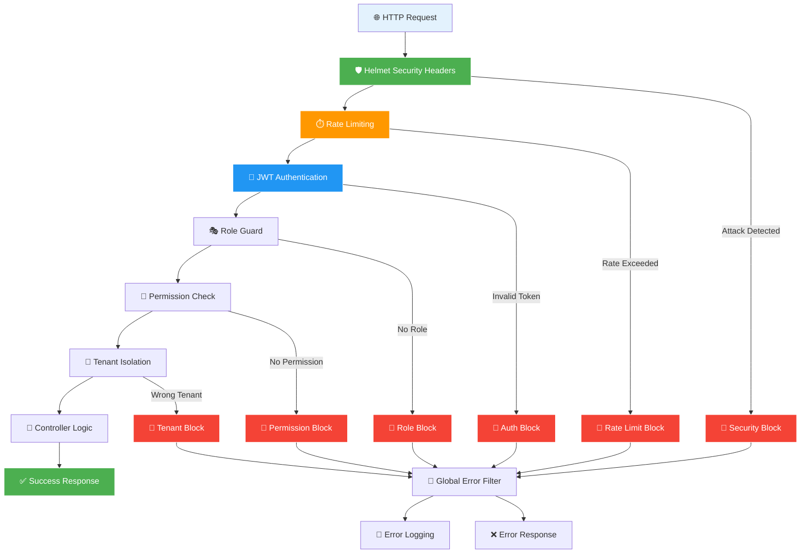
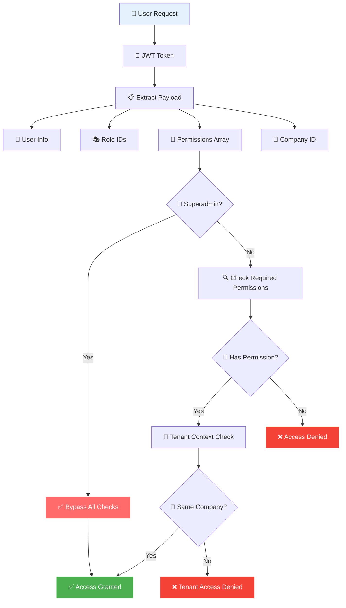

# 🛡️ Improved Security - Phase 1.1 & 1.2

## Overview

This document outlines the comprehensive security improvements implemented during Phase 1.1 (Auth Module) and Phase 1.2 (User Module) of the ERP system. These enhancements establish enterprise-grade security foundations for multi-tenant applications.

---

## 🏗️ Security Architecture Overview

### Multi-Layer Security Model


### Permission System Flow


---

## 🔒 Core Security Enhancements

### 1. **Global Exception Handling**
**File:** `src/common/filters/global-exception.filter.ts`

**What It Does:**
- Centralized exception handling across the entire application
- Prevents sensitive error details from leaking to clients
- Provides consistent error response format
- Environment-aware error reporting (dev vs production)

**Security Benefits:**
```typescript
// Production: Clean error messages
{
  "statusCode": 500,
  "error": "Internal Server Error", 
  "message": "Internal server error",
  "timestamp": "2025-01-08T10:30:00.000Z"
}

// Development: Includes stack trace for debugging
{
  "statusCode": 500,
  "error": "DatabaseError",
  "message": "Connection timeout", 
  "stack": "Error: Connection timeout\n    at Database.connect..."
}
```

**Key Features:**
- ✅ **Information Disclosure Prevention** - No internal system details exposed
- ✅ **Consistent Error Format** - Predictable responses for frontend
- ✅ **Request Context Logging** - IP, User-Agent, User ID for monitoring
- ✅ **Environment-Aware** - Different verbosity for dev/prod

---

### 2. **HTTP Security Headers (Helmet)**
**Implementation:** `src/main.ts`

**Security Headers Applied:**
```typescript
app.use(helmet({
  contentSecurityPolicy: { /* XSS protection */ },
  hsts: { maxAge: 31536000 }, // Force HTTPS for 1 year
  frameguard: { action: 'deny' }, // Prevent clickjacking
  noSniff: true, // Prevent MIME type confusion
  xssFilter: true, // Enable XSS filtering
  hidePoweredBy: true, // Hide Express fingerprinting
}));
```

**Protection Against:**
- 🚫 **XSS Attacks** - Content Security Policy blocks malicious scripts
- 🚫 **Clickjacking** - X-Frame-Options prevents iframe embedding
- 🚫 **MIME Sniffing** - X-Content-Type-Options prevents file type confusion
- 🚫 **Information Disclosure** - Hides technology stack details
- 🚫 **Man-in-the-Middle** - HSTS enforces HTTPS connections
- 🚫 **Protocol Downgrade** - Strict transport security

---

### 3. **Advanced Rate Limiting & Brute Force Protection**
**File:** `src/common/guards/custom-throttler.guard.ts`

**Multi-Layer Protection:**
```typescript
// Endpoint-specific rate limits
Auth endpoints: 5 requests/minute
Default endpoints: 100 requests/minute

// Progressive blocking system
Rate limit exceeded → IP temporarily blocked
Multiple violations → Extended blocking periods
```

**Key Features:**
- ✅ **Endpoint-Specific Limits** - Different limits for auth vs general endpoints
- ✅ **IP Blocking** - Automatic IP blocking after repeated violations
- ✅ **Progressive Penalties** - Longer blocks for repeat offenders
- ✅ **Request Fingerprinting** - Tracks requests by IP + endpoint combination
- ✅ **Security Event Logging** - All violations logged with context
- ✅ **Graceful Headers** - Rate limit status included in responses

**Brute Force Mitigation:**
```typescript
// After 5 failed login attempts:
// 1. IP blocked for 15 minutes
// 2. All subsequent requests from IP return 429
// 3. Security event logged with full context
// 4. Automatic unblocking after timeout
```

**Security Events Logged:**
- `RATE_LIMIT_EXCEEDED` - Threshold violations
- `IP_BLOCKED` - Automatic IP blocking events
- `BLOCKED_ACCESS_ATTEMPT` - Requests from blocked IPs

---

### 4. **Enterprise-Grade Permission System**
**Architecture:** Relational RBAC with granular permissions

**Security Model:**
```typescript
// Before: String-based permissions (vulnerable to typos)
Role: { permissions: ["admin", "user"] }

// After: Relational model with validation
Permission: { name: "users:delete", category: "USER_MANAGEMENT" }
RolePermission: { roleId, permissionId, companyId }
```

**Security Improvements:**
- ✅ **Foreign Key Constraints** - Prevents orphaned permissions
- ✅ **Multi-Tenant Isolation** - Company-scoped permissions
- ✅ **Granular Control** - Fine-grained permission checking
- ✅ **Audit Trail** - All permission changes tracked
- ✅ **Type Safety** - Database-enforced permission validation

**Permission Categories:**
```typescript
USER_MANAGEMENT    // users:read, users:create, users:delete
ROLE_MANAGEMENT    // roles:read, roles:assign
EMPLOYEE_MANAGEMENT // employees:read, employees:update
PAYROLL           // payroll:process, payslips:generate
ATTENDANCE        // attendance:mark, attendance:reports
LEAVES           // leaves:approve, leaves:cancel
REPORTS          // reports:financial, reports:export
SYSTEM_ADMIN     // system:config, system:backup
```

---

### 5. **Enhanced JWT Security**
**Implementation:** `src/modules/auth/auth.service.ts`

**JWT Enhancements:**
```typescript
// RS256 Algorithm with RSA key pairs
signOptions: {
  algorithm: 'RS256',           // Asymmetric encryption
  expiresIn: '15m',            // Short access token life
}

// Refresh token rotation
// Old refresh token invalidated on each refresh
// New refresh token issued with each access token
```

**Token Security Features:**
- ✅ **RSA-256 Signatures** - Cryptographically secure signing
- ✅ **Short Access Token TTL** - 15-minute expiry reduces attack window
- ✅ **Refresh Token Rotation** - Prevents replay attacks
- ✅ **Token Versioning** - Invalidates all tokens on password change
- ✅ **Session Tracking** - Database-backed session management
- ✅ **Device Fingerprinting** - IP and User-Agent tracking

**Session Management:**
```typescript
Session: {
  tokenHash,     // Hashed refresh token for validation
  userAgent,     // Device fingerprinting
  ip,           // Location tracking
  isActive,     // Session state management
  lastSeenAt,   // Activity tracking
  revokedAt     // Explicit revocation support
}
```

---

### 6. **Comprehensive Audit Logging**
**Implementation:** `src/modules/auth/auth.service.ts`

**Authentication Events Tracked:**
```typescript
AuthLog: {
  userId,       // Actor identification
  companyId,    // Multi-tenant context
  ip,          // Request origin
  userAgent,   // Device information
  type,        // LOGIN, LOGOUT, FAIL
  success,     // Operation outcome
  timestamp    // Event timing
}
```

**Security Monitoring:**
- ✅ **Failed Login Tracking** - Identifies brute force attempts
- ✅ **Session Monitoring** - Tracks user activity patterns
- ✅ **Multi-Tenant Auditing** - Company-scoped security events
- ✅ **Device Tracking** - Identifies suspicious login patterns
- ✅ **Temporal Analysis** - Time-based security analytics

---

## 🔍 Security Validation

### Permission Enforcement
```typescript
// Decorator-based security
@UseGuards(JwtGuard, RoleGuard)
@RequirePermissions('users:delete')
@Delete('users/:id')
async deleteUser() {
  // Only accessible with explicit permission
  // Multi-tenant isolation automatically enforced
  // All access attempts logged
}
```

### Request Flow Security
```
1. Rate Limiting → Check request limits
2. JWT Validation → Verify token signature  
3. Permission Check → Validate user permissions
4. Tenant Isolation → Ensure company scoping
5. Audit Logging → Record access attempt
6. Error Handling → Sanitize error responses
```

---

## 📊 Security Metrics

### Implementation Status
- ✅ **Authentication Security** - RSA-256 JWT, refresh rotation
- ✅ **Authorization Security** - Granular RBAC with 32+ permissions
- ✅ **Transport Security** - HTTPS enforcement, security headers
- ✅ **Application Security** - Rate limiting, error sanitization
- ✅ **Data Security** - Multi-tenant isolation, audit logging
- ✅ **Session Security** - Device tracking, explicit revocation

### Attack Surface Reduction
- 🚫 **Brute Force** - Progressive IP blocking
- 🚫 **XSS** - Content Security Policy + sanitization
- 🚫 **CSRF** - Same-site cookies + CORS policies
- 🚫 **Clickjacking** - Frame-options deny
- 🚫 **Information Disclosure** - Error message sanitization
- 🚫 **Session Hijacking** - Token rotation + device tracking
- 🚫 **Privilege Escalation** - Granular permission validation

---

## 🎯 Production Readiness

### Security Checklist
- ✅ **OWASP Top 10 Compliance** - Mitigates common vulnerabilities
- ✅ **Enterprise Authentication** - RSA-256 JWT with rotation
- ✅ **Audit Trail** - Comprehensive security event logging
- ✅ **Multi-Tenant Security** - Company-scoped data isolation
- ✅ **Rate Limiting** - Adaptive protection against abuse
- ✅ **Error Handling** - Production-safe error responses
- ✅ **Security Headers** - Complete HTTP security profile

### Monitoring & Alerting Ready
```typescript
// Security events available for monitoring:
- Failed authentication attempts
- Rate limit violations  
- Permission denied events
- Suspicious session patterns
- Cross-tenant access attempts
```

---

## 🚀 Next Steps

The security foundation established in Phase 1.1 & 1.2 enables:

1. **Tenant Context Resolution** - Secure multi-tenancy
2. **Advanced Audit Logging** - Complete change tracking
3. **Module-based Feature Toggles** - Subscription security
4. **API Security** - Rate limiting for all endpoints
5. **Compliance Frameworks** - GDPR, SOX, employment law compliance

This security architecture scales from startup to enterprise, providing the foundation for a production-ready ERP system.

---

*Last Updated: January 8, 2025*
*Phase: 1.1 & 1.2 Complete*
*Status: Production Ready*