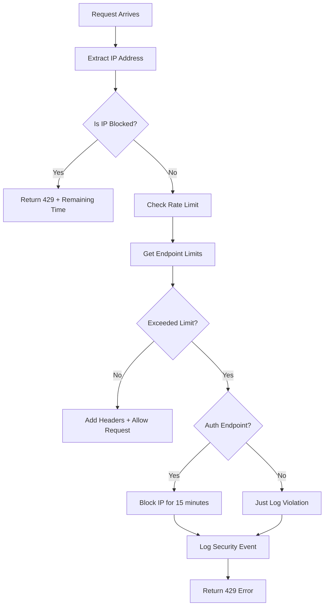

# Rate Limiting Implementation Guide

## Table of Contents
1. [What is Rate Limiting?](#what-is-rate-limiting)
2. [Why Do We Need It?](#why-do-we-need-it)
3. [What Was Implemented](#what-was-implemented)
4. [Files Created/Modified](#files-createdmodified)
5. [How It Works](#how-it-works)
6. [Configuration](#configuration)
7. [Testing](#testing)
8. [Customization](#customization)
9. [Troubleshooting](#troubleshooting)

## What is Rate Limiting?

Rate limiting is a security technique that controls the number of requests a user can make to your API within a specific time window. It prevents abuse, protects against attacks, and ensures fair usage of your resources.

**Example:**
- Allow only 5 login attempts per minute per IP address
- Allow only 100 API calls per minute for general endpoints
- Block IP temporarily if limits are exceeded

## Why Do We Need It?

### Security Protection
- **Brute Force Attacks**: Prevents attackers from trying thousands of password combinations
- **DDoS Attacks**: Protects against overwhelming your server with requests
- **API Abuse**: Stops malicious users from overusing your resources

### Real-World Examples
```
Without Rate Limiting:
❌ Attacker tries 1000 passwords in 1 minute → Might break in
❌ Bot makes 10,000 requests in 1 second → Server crashes

With Rate Limiting:
✅ Only 5 login attempts per minute → Attacker blocked after 5 tries
✅ Only 100 requests per minute → Bot blocked, server protected
```

## What Was Implemented

### 🔒 Complete Rate Limiting System
1. **IP-based tracking** - Each IP address has separate limits
2. **Different limits per endpoint** - Stricter for auth, lenient for others
3. **Automatic blocking** - Temporary IP bans for repeated violations
4. **Security logging** - Track and log all violations
5. **Response headers** - Tell clients their remaining limits

### 🛡️ Protection Levels
```
General Endpoints: 100 requests/minute
├── Login: 5 attempts/minute → 15min block if exceeded
├── Refresh: 10 attempts/minute → 15min block if exceeded
└── Logout: 20 attempts/minute → 15min block if exceeded
```

### 📊 Features
- ✅ Zero cost (uses server memory, no external services)
- ✅ Configurable via environment variables
- ✅ Integration with existing auth logging
- ✅ Real-time blocking and unblocking
- ✅ Helpful error messages with remaining time

## Files Created/Modified

### 📁 Files Overview

```
backend/
├── src/
│   ├── app.module.ts                     [MODIFIED] - Added global guard
│   ├── main.ts                           [MODIFIED] - Removed manual setup
│   ├── config/
│   │   └── rate-limit.config.ts          [CREATED] - Configuration settings
│   ├── common/guards/
│   │   └── custom-throttler.guard.ts     [CREATED] - Main rate limiting logic
│   └── modules/auth/
│       └── auth.controller.ts            [MODIFIED] - Removed decorators
└── package.json                          [MODIFIED] - Added @nestjs/throttler
```

### 1. **package.json** (Modified)
```json
{
  "dependencies": {
    "@nestjs/throttler": "^6.4.0"  // Added this package
  }
}
```

### 2. **src/config/rate-limit.config.ts** (Created)
**Purpose**: Central configuration for all rate limiting settings

```typescript
export interface RateLimitConfig {
  defaultTtl: number;        // Time window for general endpoints
  defaultLimit: number;      // Request limit for general endpoints
  authTtl: number;          // Time window for auth endpoints
  authLimit: number;        // Login attempt limit
  authRefreshLimit: number; // Refresh token limit
  authLogoutLimit: number;  // Logout attempt limit
  blockDuration: number;    // How long to block IPs
  enableBlocking: boolean;  // Whether to enable blocking
  logViolations: boolean;   // Whether to log violations
}
```

**What it does**:
- Reads environment variables
- Provides default values if env vars not set
- Centralizes all rate limiting configuration

### 3. **src/common/guards/custom-throttler.guard.ts** (Created)
**Purpose**: The main rate limiting engine

**Key Components**:

```typescript
@Injectable()
export class CustomThrottlerGuard implements CanActivate {
  // In-memory storage for tracking requests
  private readonly rateLimitStore = new Map<string, RateLimitData>();
  
  // In-memory storage for blocked IPs
  private readonly blockedIPs = new Map<string, number>();
```

**What it does**:
1. **Tracks every request** by IP address and endpoint
2. **Counts requests** within time windows
3. **Blocks IPs** when limits exceeded
4. **Adds response headers** showing remaining limits
5. **Logs security events** to console and database

**Request Flow**:
```
Request comes in
├── Is IP blocked? → Yes: Return 429 error with remaining time
├── No: Check rate limit for this IP + endpoint
├── Exceeded limit? → Yes: Block IP (for auth endpoints) + Return 429
└── No: Allow request + Add rate limit headers
```

### 4. **src/app.module.ts** (Modified)
**Changes made**:

```typescript
// ADDED imports
import { ThrottlerModule } from '@nestjs/throttler';
import { APP_GUARD } from '@nestjs/core';
import { CustomThrottlerGuard } from './common/guards/custom-throttler.guard';

// ADDED to imports array
ThrottlerModule.forRoot([
  {
    name: 'default',
    ttl: RATE_LIMIT_CONFIG.defaultTtl,
    limit: RATE_LIMIT_CONFIG.defaultLimit,
  },
  {
    name: 'auth', 
    ttl: RATE_LIMIT_CONFIG.authTtl,
    limit: RATE_LIMIT_CONFIG.authLimit,
  },
]),

// ADDED to providers array
{
  provide: APP_GUARD,
  useClass: CustomThrottlerGuard,
}
```

**What this does**:
- Sets up the throttler module with configuration
- Makes CustomThrottlerGuard a global guard (applies to all endpoints)

### 5. **src/modules/auth/auth.controller.ts** (Modified)
**Changes made**:

```typescript
// REMOVED these imports
import { Throttle } from '@nestjs/throttler';
import { RATE_LIMIT_CONFIG } from '../../config/rate-limit.config';

// REMOVED these decorators from each endpoint
@Throttle({ auth: { limit: 5, ttl: 60000 } })
```

**Why removed**: The global guard now handles all rate limiting, so individual decorators are not needed.

### 6. **src/main.ts** (Modified)
**Changes made**:

```typescript
// REMOVED manual guard setup
// Global rate limiting (applied automatically via @UseGuards or module setup)
```

**Why**: The global guard is now set up in app.module.ts, so no manual setup needed.

## How It Works

### 🔄 Request Processing Flow



### 🗃️ Data Storage Structure

**Rate Limit Store** (In Memory):
```typescript
Key: "POST:/auth/login:192.168.1.100"
Value: {
  count: 3,           // Current request count
  windowStart: 1640995200000,  // When window started
  lastReset: 1640995260000     // When window resets
}
```

**Blocked IPs Store** (In Memory):
```typescript
Key: "192.168.1.100"
Value: 1640996100000  // Timestamp when block expires
```

### 🎯 Endpoint-Specific Limits

The guard automatically detects endpoint types and applies appropriate limits:

```typescript
private getRateLimitsForEndpoint(request: Request) {
  if (request.url.includes('/auth/login')) {
    return { limit: 5, ttl: 60000 };     // 5 per minute
  } else if (request.url.includes('/auth/refresh')) {
    return { limit: 10, ttl: 60000 };    // 10 per minute
  } else if (request.url.includes('/auth/logout')) {
    return { limit: 20, ttl: 60000 };    // 20 per minute
  } else {
    return { limit: 100, ttl: 60000 };   // 100 per minute (default)
  }
}
```

## Configuration

### 🔧 Environment Variables

Create or update your `.env` file with these variables:

```env
# Rate Limiting Configuration

# General endpoints (default: 100 requests per minute)
RATE_LIMIT_TTL=60000                    # Time window in milliseconds
RATE_LIMIT_DEFAULT=100                  # Request limit

# Auth endpoints  
RATE_LIMIT_AUTH_TTL=60000              # Time window for auth endpoints
RATE_LIMIT_AUTH_LOGIN=5                # Login attempts per minute
RATE_LIMIT_AUTH_REFRESH=10             # Refresh attempts per minute
RATE_LIMIT_AUTH_LOGOUT=20              # Logout attempts per minute

# Blocking settings
RATE_LIMIT_BLOCK_DURATION=900000       # Block duration (15 minutes in ms)

# Feature toggles
RATE_LIMIT_ENABLE_BLOCKING=true        # Enable IP blocking
RATE_LIMIT_LOG_VIOLATIONS=true         # Log rate limit violations
```

### 📊 Default Values

If environment variables are not set, these defaults are used:

| Setting | Default | Description |
|---------|---------|-------------|
| `RATE_LIMIT_TTL` | 60000 | 1 minute window |
| `RATE_LIMIT_DEFAULT` | 100 | 100 requests/minute |
| `RATE_LIMIT_AUTH_TTL` | 60000 | 1 minute for auth |
| `RATE_LIMIT_AUTH_LOGIN` | 5 | 5 login attempts/minute |
| `RATE_LIMIT_AUTH_REFRESH` | 10 | 10 refresh attempts/minute |
| `RATE_LIMIT_AUTH_LOGOUT` | 20 | 20 logout attempts/minute |
| `RATE_LIMIT_BLOCK_DURATION` | 900000 | 15 minutes block |
| `RATE_LIMIT_ENABLE_BLOCKING` | true | Blocking enabled |
| `RATE_LIMIT_LOG_VIOLATIONS` | true | Logging enabled |

## Testing

### 🧪 Real-World Testing Experience

#### **Step 1: Start Your Server**
```bash
npm run start:dev
```

#### **Step 2: Test Rate Limiting in Action**

**Make 6 rapid login attempts:**
```bash
# Try multiple failed logins rapidly
for i in {1..6}; do
  echo "=== Login Attempt $i ==="
  curl -X POST http://localhost:8080/auth/login \
    -H "Content-Type: application/json" \
    -d '{"email":"test@test.com","password":"wrongpassword"}' \
    -i
  echo ""
done
```

#### **Step 3: Expected Results**

**Attempts 1-5**: Normal 401 Unauthorized (invalid credentials)
```json
{
  "statusCode": 401,
  "message": "Incorrect password"
}
```

**Attempt 6**: Rate limit warning
```json
{
  "message": "Rate limit exceeded. Further violations may result in temporary blocking.",
  "statusCode": 429,
  "error": "Rate Limit Exceeded"
}
```

**Attempt 7+**: IP blocked for 15 minutes
```json
{
  "message": "Too many requests. IP blocked for 14 more minutes.",
  "statusCode": 429,
  "error": "Rate Limit Exceeded",
  "retryAfter": 840
}
```

#### **Step 4: Verify Blocking Behavior**

**Test that auth endpoints are blocked:**
```bash
# All these will be blocked
curl -X POST http://localhost:8080/auth/login -H "Content-Type: application/json" -d '{"email":"test","password":"test"}'
curl -X POST http://localhost:8080/auth/refresh -H "Content-Type: application/json" -d '{}'
curl -X POST http://localhost:8080/auth/logout -H "Content-Type: application/json" -d '{}'
```

**Test that other endpoints still work:**
```bash
# This should still work (not blocked)
curl http://localhost:8080/
curl http://localhost:8080/users  # If you have this endpoint
```

#### **Step 5: Watch Server Logs**

You'll see security logs in your console:
```bash
[SECURITY] 2024-01-15T10:30:00.000Z - RATE_LIMIT_EXCEEDED: {
  ip: '127.0.0.1',
  route: 'POST /auth/login',
  userAgent: 'curl/7.68.0',
  headers: { origin: undefined, referer: undefined }
}

[SECURITY] 2024-01-15T10:30:01.000Z - IP_BLOCKED: {
  ip: '127.0.0.1',
  reason: 'Auth rate limit exceeded',
  blockDuration: 900,
  route: 'POST /auth/login',
  userAgent: 'curl/7.68.0'
}

[SECURITY] 2024-01-15T10:30:02.000Z - BLOCKED_ACCESS_ATTEMPT: {
  ip: '127.0.0.1',
  remainingTime: 899,
  route: 'POST /auth/login',
  userAgent: 'curl/7.68.0'
}
```

### 📱 Response Headers

Every response includes rate limiting information:

```http
X-RateLimit-Limit: 5
X-RateLimit-Remaining: 2
X-RateLimit-Reset: 1640995260000
```

- `Limit`: Maximum requests allowed
- `Remaining`: Requests left in current window
- `Reset`: Timestamp when limit resets

### 📝 Log Output

You'll see security logs in your console:

```bash
[SECURITY] 2024-01-15T10:30:00.000Z - RATE_LIMIT_EXCEEDED: {
  ip: '127.0.0.1',
  route: 'POST /auth/login',
  userAgent: 'curl/7.68.0'
}

[SECURITY] 2024-01-15T10:30:01.000Z - IP_BLOCKED: {
  ip: '127.0.0.1',
  reason: 'Auth rate limit exceeded',
  blockDuration: 900,
  route: 'POST /auth/login'
}
```

## Using Rate Limiting with New Modules

### 🏗️ Complete Example: E-commerce ERP System

Let's build a comprehensive example showing how to add multiple modules with custom rate limiting.

#### **Step 1: Create New Modules**

**Generate the modules:**
```bash
# Generate new modules
nest generate module modules/products
nest generate controller modules/products/products  
nest generate service modules/products/products

nest generate module modules/orders
nest generate controller modules/orders/orders
nest generate service modules/orders/orders

nest generate module modules/payments
nest generate controller modules/payments/payments
nest generate service modules/payments/payments

nest generate module modules/inventory
nest generate controller modules/inventory/inventory
nest generate service modules/inventory/inventory
```

#### **Step 2: Configure Enhanced Rate Limiting**

**Update `src/config/rate-limit.config.ts`:**
```typescript
export interface RateLimitConfig {
  // General endpoints
  defaultTtl: number;
  defaultLimit: number;
  
  // Auth endpoints
  authTtl: number;
  authLimit: number;
  authRefreshLimit: number;
  authLogoutLimit: number;
  
  // New module endpoints
  productsLimit: number;
  ordersLimit: number;
  paymentsLimit: number;
  inventoryLimit: number;
  uploadLimit: number;
  adminLimit: number;
  
  // Blocking configuration
  blockDuration: number;
  enableBlocking: boolean;
  logViolations: boolean;
}

export const getRateLimitConfig = (): RateLimitConfig => ({
  // General endpoints: 100 requests per minute
  defaultTtl: parseInt(process.env.RATE_LIMIT_TTL || '60000', 10),
  defaultLimit: parseInt(process.env.RATE_LIMIT_DEFAULT || '100', 10),
  
  // Auth endpoints
  authTtl: parseInt(process.env.RATE_LIMIT_AUTH_TTL || '60000', 10),
  authLimit: parseInt(process.env.RATE_LIMIT_AUTH_LOGIN || '5', 10),
  authRefreshLimit: parseInt(process.env.RATE_LIMIT_AUTH_REFRESH || '10', 10),
  authLogoutLimit: parseInt(process.env.RATE_LIMIT_AUTH_LOGOUT || '20', 10),
  
  // New module limits
  productsLimit: parseInt(process.env.RATE_LIMIT_PRODUCTS || '200', 10),
  ordersLimit: parseInt(process.env.RATE_LIMIT_ORDERS || '150', 10),
  paymentsLimit: parseInt(process.env.RATE_LIMIT_PAYMENTS || '20', 10),
  inventoryLimit: parseInt(process.env.RATE_LIMIT_INVENTORY || '50', 10),
  uploadLimit: parseInt(process.env.RATE_LIMIT_UPLOAD || '10', 10),
  adminLimit: parseInt(process.env.RATE_LIMIT_ADMIN || '30', 10),
  
  // Block IP for 15 minutes after auth rate limit exceeded
  blockDuration: parseInt(process.env.RATE_LIMIT_BLOCK_DURATION || '900000', 10),
  
  // Security features
  enableBlocking: process.env.RATE_LIMIT_ENABLE_BLOCKING !== 'false',
  logViolations: process.env.RATE_LIMIT_LOG_VIOLATIONS !== 'false',
});

export const RATE_LIMIT_CONFIG = getRateLimitConfig();
```

#### **Step 3: Update Environment Variables**

**Add to your `.env` file:**
```env
# Rate Limiting Configuration

# General endpoints
RATE_LIMIT_TTL=60000
RATE_LIMIT_DEFAULT=100

# Auth endpoints  
RATE_LIMIT_AUTH_TTL=60000
RATE_LIMIT_AUTH_LOGIN=5
RATE_LIMIT_AUTH_REFRESH=10
RATE_LIMIT_AUTH_LOGOUT=20

# Business modules (products get higher limits - frequently accessed)
RATE_LIMIT_PRODUCTS=200
RATE_LIMIT_ORDERS=150
RATE_LIMIT_PAYMENTS=20
RATE_LIMIT_INVENTORY=50

# Sensitive operations (lower limits)
RATE_LIMIT_UPLOAD=10
RATE_LIMIT_ADMIN=30

# Blocking settings
RATE_LIMIT_BLOCK_DURATION=900000
RATE_LIMIT_ENABLE_BLOCKING=true
RATE_LIMIT_LOG_VIOLATIONS=true
```

#### **Step 4: Enhanced Custom Guard Logic**

**Update `src/common/guards/custom-throttler.guard.ts`:**
```typescript
private getRateLimitsForEndpoint(request: Request): { limit: number; ttl: number } {
  const url = request.url.toLowerCase();
  const method = request.method.toUpperCase();
  
  // Auth endpoints (strictest security)
  if (url.includes('/auth/')) {
    if (url.includes('/login')) {
      return { limit: RATE_LIMIT_CONFIG.authLimit, ttl: RATE_LIMIT_CONFIG.authTtl };
    } else if (url.includes('/refresh')) {
      return { limit: RATE_LIMIT_CONFIG.authRefreshLimit, ttl: RATE_LIMIT_CONFIG.authTtl };
    } else if (url.includes('/logout')) {
      return { limit: RATE_LIMIT_CONFIG.authLogoutLimit, ttl: RATE_LIMIT_CONFIG.defaultTtl };
    }
  }
  
  // Products endpoints (high traffic expected)
  if (url.includes('/products')) {
    // Different limits for different operations
    if (method === 'GET') {
      return { limit: RATE_LIMIT_CONFIG.productsLimit, ttl: RATE_LIMIT_CONFIG.defaultTtl };
    } else if (method === 'POST' || method === 'PUT' || method === 'DELETE') {
      return { limit: Math.floor(RATE_LIMIT_CONFIG.productsLimit / 2), ttl: RATE_LIMIT_CONFIG.defaultTtl };
    }
  }
  
  // Orders endpoints (moderate traffic)
  if (url.includes('/orders')) {
    if (method === 'GET') {
      return { limit: RATE_LIMIT_CONFIG.ordersLimit, ttl: RATE_LIMIT_CONFIG.defaultTtl };
    } else if (method === 'POST') {
      return { limit: 50, ttl: RATE_LIMIT_CONFIG.defaultTtl }; // Creating orders is sensitive
    } else {
      return { limit: 30, ttl: RATE_LIMIT_CONFIG.defaultTtl };
    }
  }
  
  // Payments endpoints (very strict - financial operations)
  if (url.includes('/payments')) {
    if (url.includes('/charge') || url.includes('/refund')) {
      return { limit: 5, ttl: RATE_LIMIT_CONFIG.defaultTtl }; // Very strict for money operations
    }
    return { limit: RATE_LIMIT_CONFIG.paymentsLimit, ttl: RATE_LIMIT_CONFIG.defaultTtl };
  }
  
  // Inventory endpoints (warehouse operations)
  if (url.includes('/inventory')) {
    if (url.includes('/stock-update') || url.includes('/bulk-update')) {
      return { limit: 20, ttl: RATE_LIMIT_CONFIG.defaultTtl }; // Bulk operations are expensive
    }
    return { limit: RATE_LIMIT_CONFIG.inventoryLimit, ttl: RATE_LIMIT_CONFIG.defaultTtl };
  }
  
  // File upload endpoints (very strict - resource intensive)
  if (url.includes('/upload') || url.includes('/files')) {
    return { limit: RATE_LIMIT_CONFIG.uploadLimit, ttl: RATE_LIMIT_CONFIG.defaultTtl };
  }
  
  // Admin endpoints (sensitive operations)
  if (url.includes('/admin')) {
    if (url.includes('/users/delete') || url.includes('/system/')) {
      return { limit: 10, ttl: RATE_LIMIT_CONFIG.defaultTtl }; // Very sensitive admin ops
    }
    return { limit: RATE_LIMIT_CONFIG.adminLimit, ttl: RATE_LIMIT_CONFIG.defaultTtl };
  }
  
  // Default for all other endpoints
  return { limit: RATE_LIMIT_CONFIG.defaultLimit, ttl: RATE_LIMIT_CONFIG.defaultTtl };
}

// Enhanced blocking logic for sensitive operations
private async handleRateLimitExceeded(request: Request, ip: string): Promise<void> {
  const url = request.url.toLowerCase();
  const isAuthEndpoint = url.includes('/auth/');
  const isPaymentEndpoint = url.includes('/payments');
  const isAdminEndpoint = url.includes('/admin');
  
  // Block IPs for sensitive endpoints
  if ((isAuthEndpoint || isPaymentEndpoint || isAdminEndpoint) && RATE_LIMIT_CONFIG.enableBlocking) {
    let blockDuration = RATE_LIMIT_CONFIG.blockDuration;
    
    // Different block durations for different severity
    if (isPaymentEndpoint) {
      blockDuration = RATE_LIMIT_CONFIG.blockDuration * 2; // 30 minutes for payment abuse
    } else if (isAdminEndpoint) {
      blockDuration = RATE_LIMIT_CONFIG.blockDuration * 3; // 45 minutes for admin abuse
    }
    
    const blockUntil = Date.now() + blockDuration;
    this.blockedIPs.set(ip, blockUntil);
    
    await this.logSecurityEvent(request, 'IP_BLOCKED', {
      ip,
      reason: `Rate limit exceeded on ${url}`,
      blockDuration: blockDuration / 1000,
      route: `${request.method} ${request.url}`,
      severity: isPaymentEndpoint ? 'HIGH' : isAdminEndpoint ? 'CRITICAL' : 'MEDIUM',
    });
  } else {
    // For other endpoints, just log the violation
    await this.logSecurityEvent(request, 'RATE_LIMIT_EXCEEDED', {
      ip,
      route: `${request.method} ${request.url}`,
    });
  }
}
```

#### **Step 5: Add All Modules to App Module**

**Update `src/app.module.ts`:**
```typescript
import { Module } from '@nestjs/common';
import { ConfigModule } from '@nestjs/config';
import { ThrottlerModule } from '@nestjs/throttler';
import { APP_GUARD } from '@nestjs/core';
import { PrismaService } from './prisma/prisma.service';
import { AppController } from './app.controller';
import { AppService } from './app.service';

// Existing modules
import { AuthModule } from './modules/auth/auth.module';
import { UserModule } from './modules/users/user.module';

// New business modules
import { ProductsModule } from './modules/products/products.module';
import { OrdersModule } from './modules/orders/orders.module';
import { PaymentsModule } from './modules/payments/payments.module';
import { InventoryModule } from './modules/inventory/inventory.module';

// Guards and config
import { CustomThrottlerGuard } from './common/guards/custom-throttler.guard';
import { RATE_LIMIT_CONFIG } from './config/rate-limit.config';

@Module({
  imports: [
    ConfigModule.forRoot({
      isGlobal: true,
    }),
    ThrottlerModule.forRoot([
      {
        name: 'default',
        ttl: RATE_LIMIT_CONFIG.defaultTtl,
        limit: RATE_LIMIT_CONFIG.defaultLimit,
      },
      {
        name: 'auth',
        ttl: RATE_LIMIT_CONFIG.authTtl,
        limit: RATE_LIMIT_CONFIG.authLimit,
      },
    ]),
    
    // All your modules (each gets automatic rate limiting)
    AuthModule,
    UserModule,
    ProductsModule,     // 200 requests/minute for GET, 100 for POST/PUT/DELETE
    OrdersModule,       // 150 requests/minute for GET, 50 for POST, 30 for others
    PaymentsModule,     // 20 requests/minute (5 for charge/refund) + 30min block
    InventoryModule,    // 50 requests/minute (20 for bulk operations)
  ],
  controllers: [AppController],
  providers: [
    AppService, 
    PrismaService,
    {
      provide: APP_GUARD,  // This ONE line protects ALL modules above!
      useClass: CustomThrottlerGuard,
    },
  ],
})
export class AppModule {}
```

#### **Step 6: Create Sample Controllers**

**Products Controller (`modules/products/products.controller.ts`):**
```typescript
import { Controller, Get, Post, Put, Delete, Body, Param } from '@nestjs/common';

@Controller('products')
export class ProductsController {
  
  @Get()  // Rate limit: 200/minute
  findAll() {
    return { message: 'All products', limit: '200/minute' };
  }
  
  @Get(':id')  // Rate limit: 200/minute
  findOne(@Param('id') id: string) {
    return { message: `Product ${id}`, limit: '200/minute' };
  }
  
  @Post()  // Rate limit: 100/minute (half of GET limit)
  create(@Body() product: any) {
    return { message: 'Product created', limit: '100/minute' };
  }
  
  @Put(':id')  // Rate limit: 100/minute
  update(@Param('id') id: string, @Body() product: any) {
    return { message: `Product ${id} updated`, limit: '100/minute' };
  }
  
  @Delete(':id')  // Rate limit: 100/minute
  remove(@Param('id') id: string) {
    return { message: `Product ${id} deleted`, limit: '100/minute' };
  }
}
```

**Payments Controller (`modules/payments/payments.controller.ts`):**
```typescript
import { Controller, Get, Post, Body, Param } from '@nestjs/common';

@Controller('payments')
export class PaymentsController {
  
  @Get()  // Rate limit: 20/minute
  findAll() {
    return { message: 'All payments', limit: '20/minute' };
  }
  
  @Post('charge')  // Rate limit: 5/minute + 30min block if exceeded!
  charge(@Body() chargeData: any) {
    return { 
      message: 'Payment charged', 
      limit: '5/minute',
      warning: 'Exceeding limit will block IP for 30 minutes!'
    };
  }
  
  @Post('refund')  // Rate limit: 5/minute + 30min block if exceeded!
  refund(@Body() refundData: any) {
    return { 
      message: 'Payment refunded', 
      limit: '5/minute',
      warning: 'Exceeding limit will block IP for 30 minutes!'
    };
  }
}
```

**Inventory Controller (`modules/inventory/inventory.controller.ts`):**
```typescript
import { Controller, Get, Post, Put, Body, Param } from '@nestjs/common';

@Controller('inventory')
export class InventoryController {
  
  @Get()  // Rate limit: 50/minute
  findAll() {
    return { message: 'All inventory', limit: '50/minute' };
  }
  
  @Put('stock-update')  // Rate limit: 20/minute (bulk operation)
  updateStock(@Body() stockData: any) {
    return { 
      message: 'Stock updated', 
      limit: '20/minute (bulk operation)' 
    };
  }
  
  @Post('bulk-update')  // Rate limit: 20/minute (bulk operation)
  bulkUpdate(@Body() bulkData: any) {
    return { 
      message: 'Bulk inventory updated', 
      limit: '20/minute (expensive operation)' 
    };
  }
}
```

#### **Step 7: Test Your New Modules**

**Test Products (High Limit):**
```bash
# Should allow many requests
for i in {1..10}; do
  curl http://localhost:8080/products
  echo "Products request $i"
done
```

**Test Payments (Very Strict):**
```bash
# Should block after 5 attempts
for i in {1..6}; do
  curl -X POST http://localhost:8080/payments/charge \
    -H "Content-Type: application/json" \
    -d '{"amount": 100}'
  echo "Payment charge attempt $i"
done
```

**Test Inventory (Moderate):**
```bash
# Bulk operations have lower limits
for i in {1..25}; do
  curl -X POST http://localhost:8080/inventory/bulk-update \
    -H "Content-Type: application/json" \
    -d '{"items": []}'
  echo "Bulk update attempt $i"
done
```

### 🎯 Expected Rate Limiting Results

| **Endpoint** | **Method** | **Limit** | **Block Duration** | **Use Case** |
|--------------|------------|-----------|-------------------|--------------|
| `/auth/login` | POST | 5/min | 15 min | Brute force protection |
| `/products` | GET | 200/min | No block | High traffic catalog |
| `/products` | POST/PUT/DELETE | 100/min | No block | Admin operations |
| `/orders` | GET | 150/min | No block | Customer browsing |
| `/orders` | POST | 50/min | No block | Order creation |
| `/payments/charge` | POST | 5/min | 30 min | Financial security |
| `/payments/refund` | POST | 5/min | 30 min | Financial security |
| `/inventory/bulk-update` | POST | 20/min | No block | Resource intensive |
| `/admin/*` | ALL | 30/min | 45 min | Admin security |
| `/upload` | ALL | 10/min | No block | File upload limits |

## Customization

### 🎨 Adding Rate Limiting to Specific Endpoints

### 🔧 Advanced Customization Examples

#### **Custom Time Windows and Limits**

**1. Different Time Windows:**
```env
# Shorter windows for sensitive operations
RATE_LIMIT_AUTH_TTL=30000        # 30 seconds for auth
RATE_LIMIT_PAYMENTS_TTL=120000   # 2 minutes for payments

# Longer windows for bulk operations  
RATE_LIMIT_BULK_TTL=300000       # 5 minutes for bulk uploads
```

**2. Graduated Blocking:**
```typescript
// In custom-throttler.guard.ts
private getBlockDuration(endpoint: string, violationCount: number): number {
  const baseBlocks = {
    auth: 15 * 60 * 1000,      // 15 minutes
    payments: 30 * 60 * 1000,  // 30 minutes  
    admin: 45 * 60 * 1000,     // 45 minutes
  };
  
  // Increase block duration for repeat offenders
  const multiplier = Math.min(violationCount, 3);
  
  if (endpoint.includes('/auth/')) {
    return baseBlocks.auth * multiplier;
  } else if (endpoint.includes('/payments/')) {
    return baseBlocks.payments * multiplier;
  } else if (endpoint.includes('/admin/')) {
    return baseBlocks.admin * multiplier;
  }
  
  return RATE_LIMIT_CONFIG.blockDuration;
}
```

#### **User-Based Rate Limiting**

**Add role-based limits:**
```typescript
// In custom-throttler.guard.ts
private getRateLimitsForUser(request: Request): { limit: number; ttl: number } {
  const user = request.user; // From JWT guard
  const baseLimit = this.getRateLimitsForEndpoint(request);
  
  if (!user) {
    return baseLimit; // Anonymous users get base limits
  }
  
  // Role-based multipliers
  const roleMultipliers = {
    admin: 5,      // Admins get 5x limits
    premium: 3,    // Premium users get 3x limits  
    pro: 2,        // Pro users get 2x limits
    basic: 1,      // Basic users get base limits
  };
  
  const multiplier = roleMultipliers[user.role] || 1;
  
  return {
    limit: baseLimit.limit * multiplier,
    ttl: baseLimit.ttl
  };
}
```

#### **IP Whitelist/Blacklist**

**Permanent whitelist for trusted IPs:**
```typescript
// In custom-throttler.guard.ts
private readonly TRUSTED_IPS = [
  '127.0.0.1',           // Localhost
  '192.168.1.100',       // Office IP
  '10.0.0.5',            // Admin workstation
];

private readonly BLOCKED_IPS = [
  '203.0.113.0',         // Known malicious IP
  '198.51.100.0',        // Blocked IP range
];

async canActivate(context: ExecutionContext): Promise<boolean> {
  const request = context.switchToHttp().getRequest<Request>();
  const ip = this.getClientIP(request);
  
  // Check permanent blacklist
  if (this.BLOCKED_IPS.includes(ip)) {
    throw new HttpException('IP permanently blocked', HttpStatus.FORBIDDEN);
  }
  
  // Skip rate limiting for trusted IPs
  if (this.TRUSTED_IPS.includes(ip)) {
    return true;
  }
  
  // Continue with normal rate limiting...
  return super.canActivate(context);
}
```

### 🎯 Production-Ready Configuration

#### **Environment-Specific Settings**

**Development (.env.development):**
```env
# Lenient limits for development
RATE_LIMIT_AUTH_LOGIN=50           # Allow more login attempts
RATE_LIMIT_PAYMENTS=100            # Higher payment testing
RATE_LIMIT_BLOCK_DURATION=60000    # 1 minute blocks only
RATE_LIMIT_ENABLE_BLOCKING=false   # Disable blocking in dev
```

**Production (.env.production):**
```env
# Strict limits for production
RATE_LIMIT_AUTH_LOGIN=3            # Very strict login attempts
RATE_LIMIT_PAYMENTS=5              # Conservative payment limits
RATE_LIMIT_BLOCK_DURATION=1800000  # 30 minute blocks
RATE_LIMIT_ENABLE_BLOCKING=true    # Enable full blocking
RATE_LIMIT_LOG_VIOLATIONS=true     # Log everything
```

#### **Monitoring Integration**

**Add metrics and alerts:**
```typescript
// In custom-throttler.guard.ts
private async logMetrics(type: string, details: any): Promise<void> {
  // Send to monitoring service
  try {
    // Example: Send to DataDog, New Relic, CloudWatch, etc.
    const metrics = {
      timestamp: Date.now(),
      type,
      ip: details.ip,
      endpoint: details.route,
      environment: process.env.NODE_ENV,
    };
    
    // Your monitoring service call
    // await monitoringService.send(metrics);
    
    // Also log critical events to database
    if (type === 'IP_BLOCKED' || type === 'RATE_LIMIT_EXCEEDED') {
      await this.authService.logAuthEvent({
        userId: undefined,
        companyId: undefined,
        ip: details.ip,
        userAgent: details.userAgent || 'unknown',
        type: 'FAIL',
        success: false,
      });
    }
  } catch (error) {
    console.error('Failed to send metrics:', error);
  }
}
```

### ⚡ Performance Optimization

#### **Memory Management**

**Automatic cleanup of old data:**
```typescript
// In custom-throttler.guard.ts
constructor(private readonly authService: AuthService) {
  // Clean up expired data every 5 minutes
  setInterval(() => {
    this.cleanup();
  }, 5 * 60 * 1000);
}

private cleanup(): void {
  const now = Date.now();
  
  // Clean expired rate limit data
  for (const [key, data] of this.rateLimitStore.entries()) {
    if (now - data.windowStart > data.lastReset) {
      this.rateLimitStore.delete(key);
    }
  }
  
  // Clean expired blocked IPs
  for (const [ip, blockUntil] of this.blockedIPs.entries()) {
    if (now > blockUntil) {
      this.blockedIPs.delete(ip);
      console.log(`[RATE_LIMIT] IP ${ip} automatically unblocked`);
    }
  }
  
  console.log(`[RATE_LIMIT] Cleanup completed. Active limits: ${this.rateLimitStore.size}, Blocked IPs: ${this.blockedIPs.size}`);
}
```

#### **Redis Integration (Scalable)**

**For multiple server instances:**
```typescript
// redis-rate-limiter.service.ts
import { Injectable } from '@nestjs/common';
import { Redis } from 'ioredis';

@Injectable()
export class RedisRateLimiterService {
  private redis = new Redis(process.env.REDIS_URL);
  
  async checkRateLimit(key: string, limit: number, ttl: number): Promise<{ allowed: boolean; remaining: number }> {
    const pipeline = this.redis.pipeline();
    pipeline.incr(key);
    pipeline.expire(key, Math.ceil(ttl / 1000));
    
    const results = await pipeline.exec();
    const count = results[0][1] as number;
    
    return {
      allowed: count <= limit,
      remaining: Math.max(0, limit - count)
    };
  }
  
  async blockIP(ip: string, duration: number): Promise<void> {
    const key = `blocked:${ip}`;
    await this.redis.setex(key, Math.ceil(duration / 1000), '1');
  }
  
  async isIPBlocked(ip: string): Promise<boolean> {
    const key = `blocked:${ip}`;
    const result = await this.redis.get(key);
    return result === '1';
  }
}
```

### 📊 Complete Testing Suite

#### **Automated Testing Script**

**Create `test-rate-limiting.sh`:**
```bash
#!/bin/bash

echo "🧪 Testing Rate Limiting System"
echo "================================"

BASE_URL="http://localhost:8080"

# Test 1: Auth rate limiting
echo "📍 Test 1: Auth Rate Limiting (5 attempts)"
for i in {1..6}; do
  echo "Login attempt $i:"
  response=$(curl -s -X POST "$BASE_URL/auth/login" \
    -H "Content-Type: application/json" \
    -d '{"email":"test@test.com","password":"wrong"}' \
    -w "%{http_code}")
  echo "Response: $response"
  echo "---"
done

echo ""

# Test 2: Products rate limiting  
echo "📍 Test 2: Products Rate Limiting (200/minute)"
echo "Making 10 rapid requests..."
for i in {1..10}; do
  response=$(curl -s "$BASE_URL/products" -w "%{http_code}")
  echo "Request $i: $response"
done

echo ""

# Test 3: Payment rate limiting
echo "📍 Test 3: Payment Rate Limiting (5/minute + 30min block)"
for i in {1..6}; do
  echo "Payment attempt $i:"
  response=$(curl -s -X POST "$BASE_URL/payments/charge" \
    -H "Content-Type: application/json" \
    -d '{"amount": 100}' \
    -w "%{http_code}")
  echo "Response: $response"
  echo "---"
done

echo ""
echo "✅ Testing completed!"
echo "Check your server logs for security events."
```

**Run the test:**
```bash
chmod +x test-rate-limiting.sh
./test-rate-limiting.sh
```

### 🚨 Security Best Practices

#### **1. Don't Expose Internal Details**
```typescript
// Bad - reveals internal structure
throw new HttpException(`Rate limit exceeded. You have made ${count} requests.`, 429);

// Good - minimal information
throw new HttpException('Rate limit exceeded. Please try again later.', 429);
```

#### **2. Use HTTPS in Production**
```typescript
// In main.ts for production
if (process.env.NODE_ENV === 'production') {
  app.use((req, res, next) => {
    if (req.header('x-forwarded-proto') !== 'https') {
      res.redirect(`https://${req.header('host')}${req.url}`);
    } else {
      next();
    }
  });
}
```

#### **3. Log Security Events to External Service**
```typescript
// Integrate with security monitoring
private async alertSecurityTeam(event: string, details: any): Promise<void> {
  if (event === 'IP_BLOCKED' || event === 'MULTIPLE_VIOLATIONS') {
    // Send to Slack, email, or security platform
    // await securityAlerts.send({
    //   level: 'HIGH',
    //   event,
    //   details
    // });
  }
}
```

## Summary

This comprehensive rate limiting system provides:

✅ **Complete Protection** - All endpoints automatically protected  
✅ **Flexible Configuration** - Easy to customize per module/endpoint  
✅ **Production Ready** - Includes monitoring, cleanup, and scaling options  
✅ **Security Focused** - Multiple blocking strategies and logging  
✅ **Performance Optimized** - Memory management and Redis support  
✅ **Developer Friendly** - Clear documentation and testing tools  

Your ERP application is now fully protected against rate limiting attacks while maintaining excellent performance for legitimate users! 🛡️🚀